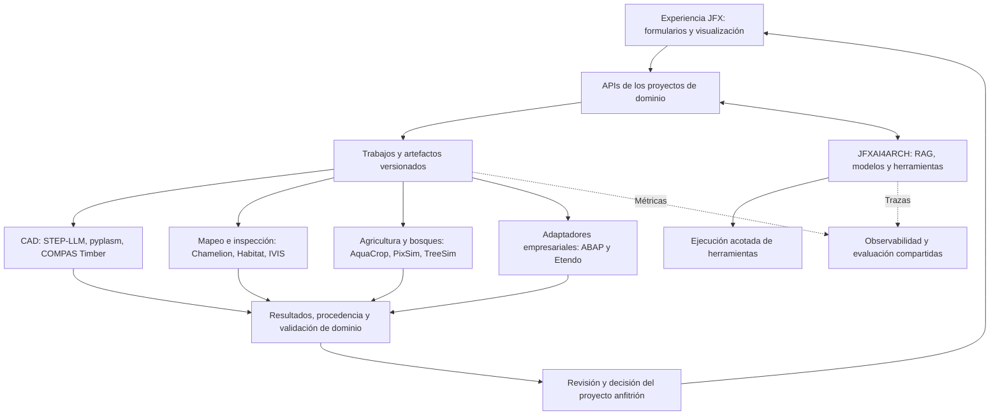
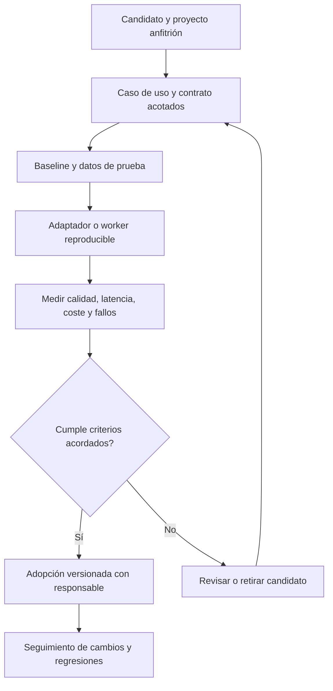

# Propuesta de integración de componentes en el portafolio JFX

**Revisión:** 4 de octubre de 2026, hora de Lima.  
**Alcance:** refactorización del archivo «propuesta categorizada estratégicamente.txt» y propuesta de integración.  
**Resultado:** 69 referencias originales clasificadas: 67 componentes, herramientas o recursos externos y dos referencias a proyectos anfitriones. No todos los elementos son paquetes instalables.

## 1. Recomendación principal

Organizar la incorporación alrededor de **servicios compartidos y adaptadores por dominio**. Cada proyecto JFX debe conservar sus modelos, datos y decisiones; la infraestructura de IA puede reutilizarse sin convertir todo el portafolio en una única aplicación ni exigir que todos los componentes ejecuten dentro de GraalVM.

La primera selección debe favorecer un flujo pequeño y verificable. Propongo comenzar por RAG técnico y observabilidad en **JFXAI4ARCH**, y después demostrar una integración de dominio en **JFXAI4DIA**, **JFXLMS4AIR** o **JFXFMIS**, según los datos y equipos disponibles.

Los destinos y prioridades de este documento son **recomendaciones de arquitectura**, inferidas del alcance publicado de los proyectos. No constituyen integraciones ya implementadas. La revisión comprobó metadatos de los repositorios y README de los destinos principales y de los componentes ambiguos; no compiló ni auditó todo el código.

## 2. Cambios que corrigen la lista original

| Referencia | Clasificación corregida | Consecuencia para el portafolio |
| --- | --- | --- |
| `jfx-meta`, `jfx-embodied-ai`, `jfx-ai-infra`, `jfx-eval-tools`, `jfx-julia`, `jfx-edge-hardware`, `jfx-enterprise-copilots` | Etiquetas temáticas del adjunto, no repositorios confirmados | Usarlas como categorías; asignar responsables a proyectos existentes |
| `jfxai4agri` | No apareció en el inventario consultado de robotics | Usar JFXFMIS como anfitrión agrícola; proponer un nuevo repositorio solo si se justifica después |
| `robotics-intelligent-systems/jfxlcdp` | Ruta no confirmada; el proyecto verificado es [sdk2035/jfxlcdp](https://github.com/sdk2035/jfxlcdp) | Mantener explícita la frontera entre robotics y las bases de sdk2035 |
| JFXAI4BSS | Su [README actual](https://github.com/robotics-intelligent-systems/jfxai4bss) trata edificios, infraestructura y comunidades inteligentes; la descripción breve conserva una referencia antigua a invernaderos | Asignar construcción en madera y ambiente construido a BSS; agronomía a FMIS |
| [TiMBA](https://github.com/sdk2035/TiMBA) | Modelo económico del mercado forestal | Escenarios de oferta, demanda y comercio, separado de fabricación robótica |
| [PixSim](https://github.com/sdk2035/PixSim) y [TreeSim](https://github.com/sdk2035/TreeSim) | Crecimiento forestal por píxeles y simulación de árboles individuales | Modelos forestales; su inclusión no demuestra generación de datasets visuales sintéticos |
| [hyperwood-bench](https://github.com/sdk2035/hyperwood-bench) | Diseño de un banco de madera | Demostrador CAD/CAM, no banco de pruebas estructural |
| [Juliana.jl](https://github.com/sdk2035/Juliana.jl) | Traducción de CUDA.jl a KernelAbstractions.jl | Portabilidad GPU en Julia; el puente Java-Julia es otro componente |
| [modular-backpack](https://github.com/sdk2035/modular-backpack) y [Backpack](https://github.com/sdk2035/Backpack) | Hardware para toolchangers Voron y firmware ExpressLRS, respectivamente | Dos usos diferentes; ninguno debe presentarse como mochila genérica de sensores |
| [SpeedSeed3](https://github.com/sdk2035/SpeedSeed3) | Cámara de crecimiento acelerado | Automatización ambiental experimental; no clasificarla como sembradora o sistema de selección fenotípica demostrado |
| [chamelion](https://github.com/sdk2035/chamelion) | Detección de cambios LiDAR | Encaje directo en JFXLMS4AIR, no en metaprogramación |
| [Relevance AI](https://github.com/sdk2035/relevanceai) | SDK de acceso a una plataforma externa | Conector opcional con cuenta y servicio; no reemplaza una plataforma autoalojada |
| [open-jev](https://github.com/sdk2035/open-jev) y [AnyJev](https://github.com/sdk2035/AnyJev) | Implementaciones de scoring/decisión | Componentes candidatos para evaluación, no suites universales de benchmark |
| [ABAP basic trial](https://github.com/sdk2035/abap-platform-basic-trial) | Material de taller y configuración de un entorno SAP | Referencia formativa; no es un runtime SAP redistribuible por ser público el repositorio |

## 3. Proyectos anfitriones recomendados

| Proyecto verificado | Responsabilidad propuesta | Primera entrega útil |
| --- | --- | --- |
| [JFXAI4ARCH](https://github.com/robotics-intelligent-systems/jfxai4arch) | Servicios comunes de RAG, herramientas de agentes, inferencia y trazabilidad | Consulta de documentación con citas y registro reproducible de cada respuesta |
| [JFXAI4NLP](https://github.com/robotics-intelligent-systems/jfxai4nlp) | Extracción lingüística, inteligencia de código y evaluación | Dataset etiquetado y comparación de extractores/evaluadores |
| [JFXAI4DIA](https://github.com/robotics-intelligent-systems/jfxai4dia) | Generación y validación de artefactos CAD | Texto a STEP candidato, validación geométrica y visualización |
| [JFXLMS4AIR](https://github.com/robotics-intelligent-systems/jfxlms4air) | Localización, mapeo y percepción para inspección | Detección de cambios sobre dos capturas LiDAR versionadas |
| [JFXFMIS](https://github.com/robotics-intelligent-systems/jfxfmis) | Operaciones agrícolas, modelos de cultivo y telemetría | Escenarios suelo-cultivo-agua con AquaCrop-OSPy |
| [JFXAI4BSS](https://github.com/robotics-intelligent-systems/jfxai4bss) | Ambiente construido, infraestructura y gemelos de edificios | Intercambio de un modelo de entramado de madera y su evidencia |
| [JFXOSMS](https://github.com/robotics-intelligent-systems/jfxosms) | Microfábrica, fabricación e inspección de calidad | Resultado de inspección visual vinculado a pieza/lote |
| [JFXSCADA](https://github.com/robotics-intelligent-systems/jfxscada) | Activos, puntos, alarmas e históricos de telemetría | Ingesta de sensores con unidades, timestamps y calidad de dato |
| [JFXRTESS](https://github.com/robotics-intelligent-systems/jfxrtess) | Firmware, bancos embebidos y pruebas de integración | Build reproducible de una placa y resultados de banco |
| [JFXAI4CV](https://github.com/robotics-intelligent-systems/jfxai4cv) y [JFXAI4RSS](https://github.com/robotics-intelligent-systems/jfxai4rss) | Imagen médica y simulación quirúrgica de investigación | Máscaras volumétricas revisadas para un escenario de simulación |
| [JFXAI4BPM](https://github.com/robotics-intelligent-systems/jfxai4bpm), [JFXAI4CRM](https://github.com/robotics-intelligent-systems/jfxai4crm) y [JFXAI4OHS](https://github.com/robotics-intelligent-systems/jfxai4ohs) | Procesos, relaciones comerciales y compras | Adaptador empresarial de consulta con contratos y auditoría |
| [sdk2035/jfxlcdp](https://github.com/sdk2035/jfxlcdp) | Base complementaria de autoría y UI declarativa | Formularios para ejecutar y comparar trabajos de dominio |
| [sdk2035/jfxengine](https://github.com/sdk2035/jfxengine) y [sdk2035/jfxmodelica](https://github.com/sdk2035/jfxmodelica) | Bases complementarias de visualización y simulación | Consumir artefactos y resultados mediante contratos abiertos |
| [sdk2035/jfxlegacy2modern](https://github.com/sdk2035/jfxlegacy2modern) | Base complementaria para modernización de código | Un caso Java o ABAP trazable, con pruebas antes/después |

**Otros consumidores posibles:** JFXAI4RS para mapas forestales; JFXAI4CBS para evaluar políticas de ejecución de agentes; JFXLMS para material educativo. Su asignación es una extensión propuesta basada en su descripción pública, no una capacidad comprobada.

## 4. Arquitectura de integración propuesta

La arquitectura propone tres formas de conexión, según el componente:

1. **Biblioteca dentro del proceso:** para componentes JVM compatibles y acotados, como un extractor Java, después de comprobar dependencias y licencia.
2. **Worker o servicio separado:** opción inicial para Python científico, R, Julia, GPU y sistemas ERP. Devuelve identificadores de trabajos, artefactos y diagnósticos; evita hacer depender toda la UI de un runtime nativo.
3. **Herramienta de desarrollo o recurso documental:** especificaciones C#, IDEs, ejemplos y diseños de hardware. Se integran al proceso de trabajo o al catálogo, no al runtime de producción.

**Contratos iniciales propuestos** — nombres de diseño, no APIs existentes:

| Contrato | Campos mínimos | Uso |
| --- | --- | --- |
| Trabajo | `job_id`, proyecto, operación, entradas, versiones, estado, error | Generación CAD, simulación y análisis |
| Artefacto | `artifact_id`, URI, hash, formato, unidades, sistema de coordenadas, procedencia | STEP, nubes de puntos, mapas, máscaras y resultados |
| Evidencia | caso de prueba, expectativa, resultado, tolerancia, versión, revisor | Aceptación técnica independiente del LLM |
| Telemetría | activo, señal, unidad, timestamp, calidad, versión de esquema | FMIS, SCADA y bancos RTESS |
| Herramienta de agente | nombre, esquema de entrada/salida, permisos, tiempo máximo, idempotencia | MCP o adaptadores de operaciones |

Los modelos proponen o explican; validadores geométricos, pruebas de código y simulaciones comprueban el resultado. Los comandos sobre hardware quedan en las interfaces de control del proyecto correspondiente.

## 5. Catálogo refactorizado completo

**Prioridades:** P0 = candidato a la base del primer piloto; P1 = siguiente integración de dominio; P2 = experimento condicionado a una necesidad concreta; R = referencia, demostrador o herramienta de desarrollo; H = proyecto anfitrión. P0 no significa dependencia ya aprobada.

En cada fila, la función procede del repositorio consultado; destino y forma de conexión son la propuesta de este análisis. Los enlaces a upstream identifican la procedencia declarada del fork, sin afirmar que ambos estén sincronizados.

### 5.1. Metaprogramación y modelos

| Componente y procedencia | Función | Destino propuesto | Conexión y condición de adopción | Prioridad |
| --- | --- | --- | --- | --- |
| [usethesource/rascal](https://github.com/usethesource/rascal) | Análisis, gramáticas y transformaciones de lenguajes | [jfxlcdp](https://github.com/sdk2035/jfxlcdp), [jfxlegacy2modern](https://github.com/sdk2035/jfxlegacy2modern), [jfxai4nlp](https://github.com/robotics-intelligent-systems/jfxai4nlp) | Extraer hechos y AST con referencias al código; definir un IR versionado. No equivale por sí solo a una integración Truffle. | P0 |
| [abertschi/graalphp](https://github.com/abertschi/graalphp) | Implementación experimental de PHP sobre GraalVM | [jfxlegacy2modern](https://github.com/sdk2035/jfxlegacy2modern) | Evaluar un subconjunto PHP mediante pruebas diferenciales; no asumir compatibilidad con un ERP PHP completo. | P2 |
| [sdk2035/spoon](https://github.com/sdk2035/spoon) · [upstream](https://github.com/INRIA/spoon) | Análisis y transformación de fuentes Java | [jfxlcdp](https://github.com/sdk2035/jfxlcdp), [jfxlegacy2modern](https://github.com/sdk2035/jfxlegacy2modern) | Usar como extractor Java especializado; intercambiar hechos con Rascal mediante un esquema común. | P0 |
| [sdk2035/MPS](https://github.com/sdk2035/MPS) · [upstream](https://github.com/JetBrains/MPS) | Entorno para construir DSL con editores específicos | [jfxlcdp](https://github.com/sdk2035/jfxlcdp), [jfxengine](https://github.com/sdk2035/jfxengine) | Prototipar un DSL de requisitos o configuración; exportar modelos, sin obligar al usuario final a instalar el editor. | P2 |
| [sdk2035/Metalama](https://github.com/sdk2035/Metalama) · [upstream](https://github.com/metalama/Metalama) | Metaprogramación y patrones de arquitectura C# sobre Roslyn | [jfxlegacy2modern](https://github.com/sdk2035/jfxlegacy2modern) | Herramienta de compilación en una cadena .NET separada; exportar diagnósticos y artefactos. | P2 |
| [sdk2035/csharplang](https://github.com/sdk2035/csharplang) · [upstream](https://github.com/dotnet/csharplang) | Especificaciones y diseño de C# | [jfxlegacy2modern](https://github.com/sdk2035/jfxlegacy2modern), [jfxai4nlp](https://github.com/robotics-intelligent-systems/jfxai4nlp) | Corpus de referencia versionado para reglas y RAG; no es un compilador ni un motor de ejecución. | R |
| [sdk2035/procyon](https://github.com/sdk2035/procyon) · [upstream](https://github.com/mstrobel/procyon) | Herramientas de metaprogramación y descompilación JVM | [jfxlegacy2modern](https://github.com/sdk2035/jfxlegacy2modern) | Analizar binarios autorizados cuando falten fuentes; conservar incertidumbres y comprobar resultados. | P2 |
| [sdk2035/openflexo-core](https://github.com/sdk2035/openflexo-core) · [upstream](https://github.com/openflexo-team/openflexo-core) | Infraestructura de federación de modelos | [jfxengine](https://github.com/sdk2035/jfxengine), [jfxlcdp](https://github.com/sdk2035/jfxlcdp) | Adaptador de modelos con IDs estables; compararlo con el IR propio antes de incorporar otro núcleo. | P2 |
| [sdk2035/pamela](https://github.com/sdk2035/pamela) · [upstream](https://github.com/openflexo-team/pamela) | Framework de modelado del ecosistema Openflexo | [jfxengine](https://github.com/sdk2035/jfxengine), [jfxlcdp](https://github.com/sdk2035/jfxlcdp) | Evaluarlo junto con Openflexo para modelos y persistencia; no presentarlo como verificador universal. | P2 |
| [sdk2035/diana](https://github.com/sdk2035/diana) · [upstream](https://github.com/openflexo-team/diana) | Motor gráfico orientado a diagramas | [jfxlcdp](https://github.com/sdk2035/jfxlcdp), [jfxengine](https://github.com/sdk2035/jfxengine) | Prueba de editor y exportación; comprobar integración con la UI elegida y evitar duplicar el editor existente. | P2 |
| [sdk2035/connie](https://github.com/sdk2035/connie) · [upstream](https://github.com/openflexo-team/connie) | Expresiones y vinculaciones sobre APIs Java | [jfxlcdp](https://github.com/sdk2035/jfxlcdp) | Evaluar expresiones de propiedades con funciones permitidas y tratamiento de errores; no asumir aislamiento de seguridad. | P2 |

### 5.2. CAD y fabricación en madera

| Componente y procedencia | Función | Destino propuesto | Conexión y condición de adopción | Prioridad |
| --- | --- | --- | --- | --- |
| [sdk2035/STEP-LLM](https://github.com/sdk2035/STEP-LLM) · [upstream](https://github.com/JasonShiii/STEP-LLM) | Generación experimental de STEP desde lenguaje natural | [jfxai4dia](https://github.com/robotics-intelligent-systems/jfxai4dia), [jfxengine](https://github.com/sdk2035/jfxengine) | Worker de inferencia que devuelve STEP, parámetros y evidencias; validar geometría antes de mostrarla como diseño aceptado. | P1 |
| [sdk2035/pyplasm](https://github.com/sdk2035/pyplasm) · [upstream](https://github.com/plasm-language/pyplasm) | Lenguaje de diseño geométrico y sólido paramétrico | [jfxai4dia](https://github.com/robotics-intelligent-systems/jfxai4dia), [jfxengine](https://github.com/sdk2035/jfxengine) | Worker Python para geometrías reproducibles y exportaciones verificadas; ensayar compatibilidad antes de usar GraalPy. | P1 |
| [sdk2035/compas_timber](https://github.com/sdk2035/compas_timber) · [upstream](https://github.com/gramaziokohler/compas_timber) | Diseño de estructuras entramadas de madera | [jfxai4bss](https://github.com/robotics-intelligent-systems/jfxai4bss), [jfxai4dia](https://github.com/robotics-intelligent-systems/jfxai4dia), [jfxosms](https://github.com/robotics-intelligent-systems/jfxosms) | Conectar geometría, uniones y datos de fabricación mediante adaptadores; no confundir diseño con certificación estructural. | P1 |
| [sdk2035/hyperwood-bench](https://github.com/sdk2035/hyperwood-bench) · [upstream](https://github.com/jo/hyperwood-bench) | Diseño paramétrico de un banco de madera | [jfxai4dia](https://github.com/robotics-intelligent-systems/jfxai4dia), [jfxosms](https://github.com/robotics-intelligent-systems/jfxosms) | Caso demostrador de diseño a fabricación y lista de materiales; no es un benchmark biomecánico. | R |

### 5.3. Percepción y robótica de inspección

| Componente y procedencia | Función | Destino propuesto | Conexión y condición de adopción | Prioridad |
| --- | --- | --- | --- | --- |
| [sdk2035/chamelion](https://github.com/sdk2035/chamelion) · [upstream](https://github.com/url-kaist/chamelion) | Detección de cambios entre escaneos LiDAR y mapas previos | [jfxlms4air](https://github.com/robotics-intelligent-systems/jfxlms4air) | Servicio por lotes de cambios añadidos/retirados con confianza; evaluar errores en mapas de inspección. | P1 |
| [sdk2035/habitat-sim](https://github.com/sdk2035/habitat-sim) · [upstream](https://github.com/facebookresearch/habitat-sim) | Simulador 3D para investigación en agentes embodied | [jfxlms4air](https://github.com/robotics-intelligent-systems/jfxlms4air), [jfxengine](https://github.com/sdk2035/jfxengine) | Generar episodios reproducibles de navegación y percepción; entregar observaciones y métricas a la consola. | P1 |
| [sdk2035/habitat-lab](https://github.com/sdk2035/habitat-lab) · [upstream](https://github.com/facebookresearch/habitat-lab) | Tareas, entrenamiento y evaluación de agentes embodied | [jfxlms4air](https://github.com/robotics-intelligent-systems/jfxlms4air) | Capa de experimentación sobre el simulador, con versiones de escena, agente y tarea fijadas. | P1 |
| [sdk2035/physical-ai-studio](https://github.com/sdk2035/physical-ai-studio) · [upstream](https://github.com/open-edge-platform/physical-ai-studio) | Entrenamiento robótico por imitación de demostraciones | [jfxosms](https://github.com/robotics-intelligent-systems/jfxosms), [jfxrtess](https://github.com/robotics-intelligent-systems/jfxrtess) | Piloto de manipulación en simulación y banco controlado; conservar datasets y políticas versionadas. | P2 |
| [nvidia-isaac/video_to_data](https://github.com/nvidia-isaac/video_to_data) | Pipeline de video, reconstrucción y datos de entrenamiento robótico | [jfxosms](https://github.com/robotics-intelligent-systems/jfxosms), [jfxengine](https://github.com/sdk2035/jfxengine) | Procesamiento offline de demostraciones hacia escenas/datasets; validar embodiment y simulador, sin convertir video directamente en órdenes de planta. | P2 |
| [sdk2035/Integrated-Vision-Inspection-System-IVIS](https://github.com/sdk2035/Integrated-Vision-Inspection-System-IVIS) · [upstream](https://github.com/msf4-0/Integrated-Vision-Inspection-System-IVIS) | Sistema de inspección visual industrial | [jfxosms](https://github.com/robotics-intelligent-systems/jfxosms), [jfxscada](https://github.com/robotics-intelligent-systems/jfxscada) | Adaptador de resultados de inspección hacia eventos de calidad y trazabilidad de lote. | P1 |
| [sdk2035/vision_transformer](https://github.com/sdk2035/vision_transformer) · [upstream](https://github.com/google-research/vision_transformer) | Implementaciones de Vision Transformer y MLP-Mixer | [jfxai4cv](https://github.com/robotics-intelligent-systems/jfxai4cv), [jfxosms](https://github.com/robotics-intelligent-systems/jfxosms) | Baseline de visión a comparar sobre datos propios; no presentarlo como modelo médico validado. | P2 |

### 5.4. Imagen médica y simulación

| Componente y procedencia | Función | Destino propuesto | Conexión y condición de adopción | Prioridad |
| --- | --- | --- | --- | --- |
| [sdk2035/SAM-Med3D](https://github.com/sdk2035/SAM-Med3D) · [upstream](https://github.com/uni-medical/SAM-Med3D) | Segmentación volumétrica de imágenes médicas | [jfxai4cv](https://github.com/robotics-intelligent-systems/jfxai4cv), [jfxai4rss](https://github.com/robotics-intelligent-systems/jfxai4rss) | Worker de segmentación para investigación y simulación; devolver máscaras con geometría, versión y revisión del experto. | P2 |

### 5.5. Agro, bosques y economía forestal

| Componente y procedencia | Función | Destino propuesto | Conexión y condición de adopción | Prioridad |
| --- | --- | --- | --- | --- |
| [sdk2035/aquacrop](https://github.com/sdk2035/aquacrop) · [upstream](https://github.com/aquacropos/aquacrop) | AquaCrop-OSPy: modelo suelo-cultivo-agua | [jfxfmis](https://github.com/robotics-intelligent-systems/jfxfmis) | Servicio de escenarios de riego con clima, suelo y cultivo; registrar unidades, parámetros y resultados de calibración. | P1 |
| [sdk2035/Drip-3Dponics](https://github.com/sdk2035/Drip-3Dponics) · [upstream](https://github.com/3dponics/Drip-3Dponics) | Diseños imprimibles para hidroponía | [jfxfmis](https://github.com/robotics-intelligent-systems/jfxfmis), [jfxai4dia](https://github.com/robotics-intelligent-systems/jfxai4dia) | Catálogo CAD y materiales del sistema; instrumentación y control requieren componentes adicionales. | P2 |
| [sdk2035/SpeedSeed3](https://github.com/sdk2035/SpeedSeed3) · [upstream](https://github.com/GrowCab/SpeedSeed3) | Sistema de crecimiento acelerado en cámara de sobremesa | [jfxfmis](https://github.com/robotics-intelligent-systems/jfxfmis), [jfxscada](https://github.com/robotics-intelligent-systems/jfxscada) | Integrar registros ambientales y recetas experimentales; revisar dependencias antiguas antes de reutilizar el software. | P2 |
| [sdk2035/TiMBA](https://github.com/sdk2035/TiMBA) · [upstream](https://github.com/TI-Forest-Sector-Modelling/TiMBA) | Modelo económico de mercados de productos forestales | [jfxfmis](https://github.com/robotics-intelligent-systems/jfxfmis), [jfxai4bpm](https://github.com/robotics-intelligent-systems/jfxai4bpm) | Módulo opcional de escenarios de oferta, demanda y comercio; resultados agregados separados del control de cultivo. | P2 |
| [sdk2035/PixSim](https://github.com/sdk2035/PixSim) · [upstream](https://github.com/nicoscattaneo/PixSim) | Simulación de crecimiento forestal por píxeles en R | [jfxfmis](https://github.com/robotics-intelligent-systems/jfxfmis), [jfxai4rs](https://github.com/robotics-intelligent-systems/jfxai4rs) | Worker R con mapas y escenarios de crecimiento; no catalogarlo como generador de follaje sintético para visión. | P2 |
| [sdk2035/TreeSim](https://github.com/sdk2035/TreeSim) · [upstream](https://github.com/AbbasNabhani/TreeSim) | Simulación de árboles individuales y visualización 3D | [jfxfmis](https://github.com/robotics-intelligent-systems/jfxfmis), [jfxengine](https://github.com/sdk2035/jfxengine) | Modelo forestal con parámetros regionales; exportar estado del bosque y geometría mediante contrato propio. | P2 |
| [sdk2035/isoblue](https://github.com/sdk2035/isoblue) · [upstream](https://github.com/oats-center/isoblue) | Hardware y software ISOBlue/Avena para datos agrícolas | [jfxfmis](https://github.com/robotics-intelligent-systems/jfxfmis), [jfxscada](https://github.com/robotics-intelligent-systems/jfxscada) | Gateway de telemetría de maquinaria; validar mensajes, tiempos y compatibilidad del equipo real. | P1 |

### 5.6. Servicios compartidos de IA

| Componente y procedencia | Función | Destino propuesto | Conexión y condición de adopción | Prioridad |
| --- | --- | --- | --- | --- |
| [sdk2035/OpenShell](https://github.com/sdk2035/OpenShell) · [upstream](https://github.com/NVIDIA/OpenShell) | Entorno de ejecución aislado para agentes | [jfxai4arch](https://github.com/robotics-intelligent-systems/jfxai4arch), [jfxai4cbs](https://github.com/robotics-intelligent-systems/jfxai4cbs) | Evaluar como runtime de trabajos con políticas y credenciales acotadas; comprobar sus garantías en el despliegue elegido. | P1 |
| [sdk2035/mcp-memory-service](https://github.com/sdk2035/mcp-memory-service) · [upstream](https://github.com/doobidoo/mcp-memory-service) | Memoria persistente para agentes con APIs y MCP | [jfxai4arch](https://github.com/robotics-intelligent-systems/jfxai4arch), [jfxai4nlp](https://github.com/robotics-intelligent-systems/jfxai4nlp) | Servicio opcional de memoria separado del repositorio de evidencia; particionar por usuario, proyecto y retención. | P1 |
| [sdk2035/ray](https://github.com/sdk2035/ray) · [upstream](https://github.com/ray-project/ray) | Cómputo distribuido y bibliotecas de IA | [jfxai4arch](https://github.com/robotics-intelligent-systems/jfxai4arch), [jfxengine](https://github.com/sdk2035/jfxengine) | Ejecutor de trabajos cuando una carga medida justifique distribución; comenzar con workers simples. | P2 |
| [sdk2035/kserve](https://github.com/sdk2035/kserve) · [upstream](https://github.com/kserve/kserve) | Servicio de inferencia sobre Kubernetes | [jfxai4arch](https://github.com/robotics-intelligent-systems/jfxai4arch) | Perfil de despliegue para equipos que ya operen Kubernetes; no es prerrequisito del primer piloto. | P2 |
| [sdk2035/langflow](https://github.com/sdk2035/langflow) · [upstream](https://github.com/langflow-ai/langflow) | Constructor de flujos y agentes de IA | [jfxai4arch](https://github.com/robotics-intelligent-systems/jfxai4arch), [jfxai4nlp](https://github.com/robotics-intelligent-systems/jfxai4nlp) | Herramienta opcional de autoría; exportar/versionar flujos y mantener contratos de ejecución independientes. | P1 |
| [sdk2035/AutoGPT](https://github.com/sdk2035/AutoGPT) · [upstream](https://github.com/Significant-Gravitas/AutoGPT) | Plataforma y herramientas de agentes | [jfxai4arch](https://github.com/robotics-intelligent-systems/jfxai4arch) | Alternativa experimental de orquestación; evaluar componentes y licencias antes de elegirla junto a otro orquestador. | P2 |
| [sdk2035/relevanceai](https://github.com/sdk2035/relevanceai) · [upstream](https://github.com/RelevanceAI/relevanceai) | SDK para la plataforma Relevance AI | [jfxai4crm](https://github.com/robotics-intelligent-systems/jfxai4crm), [jfxai4arch](https://github.com/robotics-intelligent-systems/jfxai4arch) | Conector externo opcional; requiere cuenta y condiciones del servicio, no equivale a una plataforma íntegra autoalojada. | P2 |
| [langfuse/langfuse](https://github.com/langfuse/langfuse) | Observabilidad y evaluación de aplicaciones LLM | [jfxai4arch](https://github.com/robotics-intelligent-systems/jfxai4arch), [jfxai4nlp](https://github.com/robotics-intelligent-systems/jfxai4nlp) | Contrato común de trazas, versiones, evaluaciones y métricas; comprobar duplicidades con observabilidad existente. | P0 |
| [sdk2035/semantic-caching-with-redis-langcache](https://github.com/sdk2035/semantic-caching-with-redis-langcache) · [upstream](https://github.com/redis-developer/semantic-caching-with-redis-langcache) | Demostración de caché semántica con Redis LangCache | [jfxai4arch](https://github.com/robotics-intelligent-systems/jfxai4arch) | Referencia para un experimento con invalidación, separación por tenant y medición de respuestas obsoletas. | R |
| [sdk2035/mlx](https://github.com/sdk2035/mlx) · [upstream](https://github.com/ml-explore/mlx) | Framework de arrays y ML orientado a Apple silicon | [jfxai4arch](https://github.com/robotics-intelligent-systems/jfxai4arch), [jfxai4nlp](https://github.com/robotics-intelligent-systems/jfxai4nlp) | Backend opcional para estaciones compatibles; separar este perfil del despliegue Linux/CUDA y medir modelos concretos. | P2 |
| [sdk2035/llama_index](https://github.com/sdk2035/llama_index) · [upstream](https://github.com/run-llama/llama_index) | Procesamiento de documentos y recuperación para IA | [jfxai4arch](https://github.com/robotics-intelligent-systems/jfxai4arch), [jfxai4nlp](https://github.com/robotics-intelligent-systems/jfxai4nlp) | Pipeline inicial de ingesta/RAG con citas, versiones de documentos y pruebas de recuperación. | P0 |
| [sdk2035/cohere-toolkit](https://github.com/sdk2035/cohere-toolkit) · [upstream](https://github.com/cohere-ai/cohere-toolkit) | Componentes y ejemplos para aplicaciones RAG | [jfxai4arch](https://github.com/robotics-intelligent-systems/jfxai4arch), [jfxai4crm](https://github.com/robotics-intelligent-systems/jfxai4crm) | Referencia o acelerador alternativo; aislar dependencias del proveedor mediante el gateway de modelos. | P2 |
| [Sumanth077/Hands-On-AI-Engineering](https://github.com/Sumanth077/Hands-On-AI-Engineering) | Colección educativa de proyectos OCR, RAG y agentes | [jfxai4nlp](https://github.com/robotics-intelligent-systems/jfxai4nlp), [jfxlms](https://github.com/robotics-intelligent-systems/jfxlms) | Patrones y material de aprendizaje; revisar el ejemplo grounded_document_agent antes de reutilizar código. | R |
| [sdk2035/seekdb](https://github.com/sdk2035/seekdb) · [upstream](https://github.com/oceanbase/seekdb) | Motor de búsqueda con datos vectoriales y estructurados | [jfxai4arch](https://github.com/robotics-intelligent-systems/jfxai4arch), [jfxai4nlp](https://github.com/robotics-intelligent-systems/jfxai4nlp) | Compararlo como almacén de recuperación; no reemplazar la base transaccional sin pruebas de requisitos. | P2 |

### 5.7. Evaluación y decisiones de modelos

| Componente y procedencia | Función | Destino propuesto | Conexión y condición de adopción | Prioridad |
| --- | --- | --- | --- | --- |
| [sdk2035/jevals](https://github.com/sdk2035/jevals) · [upstream](https://github.com/openlayer-ai/jevals) | Evaluaciones de trazas mediante modelos de decisión | [jfxai4nlp](https://github.com/robotics-intelligent-systems/jfxai4nlp), [jfxai4arch](https://github.com/robotics-intelligent-systems/jfxai4arch) | Comparar groundedness, selección de herramientas y alcance frente a ejemplos etiquetados por personas. | P1 |
| [sdk2035/open-jev](https://github.com/sdk2035/open-jev) · [upstream](https://github.com/daseinlabs/open-jev) | Scoring local de opciones con Gemma y MLX | [jfxai4nlp](https://github.com/robotics-intelligent-systems/jfxai4nlp) | Backend experimental de evaluación; comprobar plataforma, distribución de datos y calibración. | P2 |
| [sdk2035/AnyJev](https://github.com/sdk2035/AnyJev) · [upstream](https://github.com/nokia-applied-research/AnyJev) | Decisiones tipadas basadas en probabilidades del modelo | [jfxai4nlp](https://github.com/robotics-intelligent-systems/jfxai4nlp), [jfxai4arch](https://github.com/robotics-intelligent-systems/jfxai4arch) | Comparar con clasificadores y reglas; no interpretar las probabilidades como confiabilidad demostrada sin calibración local. | P2 |

### 5.8. Herramientas de desarrollo

| Componente y procedencia | Función | Destino propuesto | Conexión y condición de adopción | Prioridad |
| --- | --- | --- | --- | --- |
| [sdk2035/kirodex](https://github.com/sdk2035/kirodex) · [upstream](https://github.com/thabti/kirodex) | Aplicación de escritorio para agentes de programación | [jfxlcdp](https://github.com/sdk2035/jfxlcdp) | Herramienta opcional del desarrollador; no integrarla como dependencia del runtime de los productos. | R |
| [sdk2035/spec-for-codex](https://github.com/sdk2035/spec-for-codex) · [upstream](https://github.com/atman-33/spec-for-codex) | Extensión para desarrollo guiado por especificaciones | [jfxlcdp](https://github.com/sdk2035/jfxlcdp) | Evaluar formato y exportación de especificaciones en el flujo de contribución. | R |
| [sdk2035/spec-for-codex-ide](https://github.com/sdk2035/spec-for-codex-ide) · [upstream](https://github.com/atman-33/spec-for-codex-ide) | Extensión IDE para especificaciones y asistentes | [jfxlcdp](https://github.com/sdk2035/jfxlcdp) | Comparar con spec-for-codex y elegir una experiencia, evitando duplicación funcional. | R |
| [sdk2035/tasktrooper](https://github.com/sdk2035/tasktrooper) · [upstream](https://github.com/makifbaysal/tasktrooper) | Gestión de tareas y ejecución de agentes de desarrollo | [jfxai4arch](https://github.com/robotics-intelligent-systems/jfxai4arch) | Herramienta del equipo para tareas/artefactos; su uso no convierte el producto en un sistema de agentes autónomos. | R |
| [sdk2035/bruno](https://github.com/sdk2035/bruno) · [upstream](https://github.com/usebruno/bruno) | Cliente y pruebas de APIs | [jfxai4arch](https://github.com/robotics-intelligent-systems/jfxai4arch), [jfxai4bpm](https://github.com/robotics-intelligent-systems/jfxai4bpm), [jfxscada](https://github.com/robotics-intelligent-systems/jfxscada) | Colecciones versionadas de contratos, autenticación, errores, reintentos e idempotencia para adaptadores. | P0 |

### 5.9. Cómputo científico e interoperabilidad

| Componente y procedencia | Función | Destino propuesto | Conexión y condición de adopción | Prioridad |
| --- | --- | --- | --- | --- |
| [sdk2035/julia4j](https://github.com/sdk2035/julia4j) · [upstream](https://github.com/rssdev10/julia4j) | Binding Java-Julia mediante JNI y libjulia | [jfxengine](https://github.com/sdk2035/jfxengine), [jfxmodelica](https://github.com/sdk2035/jfxmodelica) | Prueba acotada de tipos, memoria y ciclo de vida; el README declara funciones básicas y tareas pendientes. | P2 |
| [sdk2035/Juliana.jl](https://github.com/sdk2035/Juliana.jl) · [upstream](https://github.com/artecs-group/Juliana.jl) | Traducción de CUDA.jl a KernelAbstractions.jl | [jfxengine](https://github.com/sdk2035/jfxengine), [jfxai4dia](https://github.com/robotics-intelligent-systems/jfxai4dia) | Experimento de portabilidad GPU sobre kernels Julia seleccionados; no es puente Java/GraalVM. | P2 |
| [genieframework/Genie.jl](https://github.com/genieframework/Genie.jl) | Framework web Julia | [jfxengine](https://github.com/sdk2035/jfxengine), [jfxmodelica](https://github.com/sdk2035/jfxmodelica) | Opción para exponer trabajos científicos como servicio; mantener una API estable hacia JavaFX. | P2 |

### 5.10. Firmware y hardware de laboratorio

| Componente y procedencia | Función | Destino propuesto | Conexión y condición de adopción | Prioridad |
| --- | --- | --- | --- | --- |
| [sdk2035/platformio-core](https://github.com/sdk2035/platformio-core) · [upstream](https://github.com/platformio/platformio-core) | Herramientas de compilación y desarrollo embebido | [jfxrtess](https://github.com/robotics-intelligent-systems/jfxrtess), [jfxscada](https://github.com/robotics-intelligent-systems/jfxscada) | Cadena de build reproducible por placa; guardar firmware, configuración y resultados de pruebas. | P1 |
| [sdk2035/Tasmota](https://github.com/sdk2035/Tasmota) · [upstream](https://github.com/arendst/Tasmota) | Firmware IoT para dispositivos ESP compatibles | [jfxscada](https://github.com/robotics-intelligent-systems/jfxscada), [jfxfmis](https://github.com/robotics-intelligent-systems/jfxfmis) | Piloto de sensores y telemetría MQTT/HTTP; no usarlo como sustituto de lógica industrial de seguridad. | P1 |
| [sdk2035/modular-backpack](https://github.com/sdk2035/modular-backpack) · [upstream](https://github.com/onsimon/modular-backpack) | Piezas y distribución de cableado para toolchangers Voron | [jfxosms](https://github.com/robotics-intelligent-systems/jfxosms), [jfxai4dia](https://github.com/robotics-intelligent-systems/jfxai4dia) | Referencia mecánica/eléctrica para impresoras del laboratorio; no es una mochila robótica portátil. | R |
| [sdk2035/Backpack](https://github.com/sdk2035/Backpack) · [upstream](https://github.com/ExpressLRS/Backpack) | Firmware ExpressLRS para hardware FPV compatible | [jfxrtess](https://github.com/robotics-intelligent-systems/jfxrtess) | Banco de evaluación de configuración y telemetría; no es equivalente a modular-backpack. | P2 |
| [sdk2035/OpenLaptop](https://github.com/sdk2035/OpenLaptop) · [upstream](https://github.com/MiklosPathy/OpenLaptop) | Diseño de hardware de un portátil | [jfxrtess](https://github.com/robotics-intelligent-systems/jfxrtess), [jfxengine](https://github.com/sdk2035/jfxengine) | Referencia de estación de laboratorio; verificar disponibilidad de componentes y coste de fabricación. | R |
| [sdk2035/Openterface_KVM-GO_Hardware](https://github.com/sdk2035/Openterface_KVM-GO_Hardware) · [upstream](https://github.com/TechxArtisanStudio/Openterface_KVM-GO_Hardware) | Archivos de diseño de hardware KVM | [jfxrtess](https://github.com/robotics-intelligent-systems/jfxrtess), [jfxscada](https://github.com/robotics-intelligent-systems/jfxscada) | Acceso de mantenimiento a equipos de banco; revisar captura, control y permisos, sin tratarlo como controlador robótico. | R |

### 5.11. Modernización empresarial y ABAP

| Componente y procedencia | Función | Destino propuesto | Conexión y condición de adopción | Prioridad |
| --- | --- | --- | --- | --- |
| [sdk2035/abap-platform-basic-trial](https://github.com/sdk2035/abap-platform-basic-trial) · [upstream](https://github.com/SAP-samples/abap-platform-basic-trial) | Workbook y preparación de entorno ABAP Cloud de SAP | [jfxlegacy2modern](https://github.com/sdk2035/jfxlegacy2modern) | Referencia de laboratorio y ejemplos; requiere un entorno SAP y no es una distribución abierta del runtime SAP. | R |
| [open-abap/open-abap-core](https://github.com/open-abap/open-abap-core) | Artefactos ABAP reutilizables para abaplint/transpiler | [jfxlegacy2modern](https://github.com/sdk2035/jfxlegacy2modern) | Ensayar un subconjunto de ABAP con tests; no representa un kernel SAP completo ni una implementación Truffle. | P1 |
| [sdk2035/abap-mcp](https://github.com/sdk2035/abap-mcp) · [upstream](https://github.com/abap-ai/mcp) | SDK de servidor MCP implementado en ABAP | [jfxai4bpm](https://github.com/robotics-intelligent-systems/jfxai4bpm), [jfxlegacy2modern](https://github.com/sdk2035/jfxlegacy2modern) | Adaptador de consulta y herramientas ABAP; el README marca esta generación como congelada y remite a mcp2 para evolución. | P1 |
| [sdk2035/ai-abap-assistant-sample](https://github.com/sdk2035/ai-abap-assistant-sample) · [upstream](https://github.com/google/ai-abap-assistant-sample) | Ejemplo de asistencia y revisión de código en el editor ABAP | [jfxlegacy2modern](https://github.com/sdk2035/jfxlegacy2modern), [jfxai4nlp](https://github.com/robotics-intelligent-systems/jfxai4nlp) | Referencia para explicación, revisión y propuestas de tests con revisión humana. | R |
| [sdk2035/SAP_Project](https://github.com/sdk2035/SAP_Project) · [upstream](https://github.com/PrithviVenu/SAP_Project) | Aplicación demostrativa de análisis ABAP para S/4HANA | [jfxlegacy2modern](https://github.com/sdk2035/jfxlegacy2modern) | Estudiar UX y flujo de análisis; exigir pruebas semánticas antes de aceptar refactorizaciones sugeridas. | R |
| [sdk2035/com.etendoerp.copilot](https://github.com/sdk2035/com.etendoerp.copilot) · [upstream](https://github.com/etendosoftware/com.etendoerp.copilot) | Copiloto y herramientas del ecosistema Etendo | [jfxai4bpm](https://github.com/robotics-intelligent-systems/jfxai4bpm), [jfxai4crm](https://github.com/robotics-intelligent-systems/jfxai4crm), [jfxai4ohs](https://github.com/robotics-intelligent-systems/jfxai4ohs) | Conector a una instancia Etendo o referencia de diseño; no asumir instalación directa en Axelor, Dolibarr u OFBiz. | P2 |

### 5.12. Proyectos anfitriones, no paquetes

| Componente y procedencia | Función | Destino propuesto | Conexión y condición de adopción | Prioridad |
| --- | --- | --- | --- | --- |
| [robotics-intelligent-systems/jfxai4bpm](https://github.com/robotics-intelligent-systems/jfxai4bpm) | Proyecto de orquestación de procesos del portafolio | [jfxai4bpm](https://github.com/robotics-intelligent-systems/jfxai4bpm) | Anfitrión de contratos y adaptadores empresariales; no contarlo como dependencia externa. | H |
| `robotics-intelligent-systems/jfxlcdp` → [sdk2035/jfxlcdp](https://github.com/sdk2035/jfxlcdp) | Referencia del adjunto que debe corregirse a sdk2035/jfxlcdp | [jfxlcdp](https://github.com/sdk2035/jfxlcdp) | Usar la ruta verificada sdk2035/jfxlcdp como proyecto de interfaz/low-code; no se confirmó un repositorio homónimo en robotics. | H |

## 6. Refactorización del stack transversal

La lista final del adjunto mezcla lenguajes, runtimes, bibliotecas, servicios gestionados y prácticas. Conviene registrar cada uno con su tipo y su responsabilidad.

| Capa | Propuesta inicial | Alternativas y límites |
| --- | --- | --- |
| UI | JavaFX para escritorio; React/TypeScript para web cuando haya un caso de uso | React es una biblioteca de UI, no un lenguaje. `reactj4j` queda como referencia sin identificar: el adjunto no proporciona repositorio ni versión |
| Núcleo y contratos | JVM para componentes Java; APIs para workers externos | GraalVM es una opción de ejecución/optimización que debe medirse; no convierte automáticamente todo el stack en una sola aplicación |
| Python científico y ML | Workers CPython para el primer prototipo; evaluar GraalPy por paquete y plataforma | GraalPy implementa Python 3; Jython mantiene la línea Python 2.7 y no es un sustituto equivalente para este ecosistema. Ver [GraalPy](https://www.graalvm.org/reference-manual/graalpy/) y [Jython](https://www.jython.org/news.html) |
| JavaScript y TypeScript | TypeScript compilado a JavaScript; servicio Node cuando requiera APIs Node | GraalJS embebido no aporta automáticamente `fs`, `http` u otras APIs de Node. Ver [documentación de interoperabilidad](https://www.graalvm.org/reference-manual/js/NashornMigrationGuide/) |
| Go | Servicio nativo con contrato HTTP/gRPC si aporta valor | `golang-jvm` queda sin identificar ni recomendar: falta una referencia concreta y pruebas de compatibilidad |
| Julia y R | Workers o servicios científicos separados | Evaluar JNI/libjulia solo si las mediciones justifican su complejidad; Juliana.jl aborda portabilidad GPU, no integración JVM |
| Orquestación LLM | Elegir un runtime principal; LlamaIndex para la ingesta propuesta, LangChain o LangChain4j si su ecosistema corresponde al servicio | Langflow puede ser autoría; AutoGPT y Relevance AI son alternativas con límites propios. Evitar desplegar todos sin una función diferenciada |
| Proveedores de modelos | Gateway intercambiable para modelos locales, OpenAI API o AWS Bedrock | Registrar proveedor, versión, datos enviados y coste por tarea; seleccionar por evaluación, sin asumir equivalencia funcional |
| Persistencia | PostgreSQL para registros transaccionales; almacenamiento de objetos para artefactos | DynamoDB es una alternativa gestionada para un patrón de acceso concreto, no una dependencia adicional obligatoria |
| Recuperación | Seleccionar un índice de texto/vectores mediante un conjunto de consultas de prueba | SeekDB es candidato comparativo; evitar introducir varias bases solo por aparecer en la lista |
| Caché | Redis únicamente donde exista beneficio medido | La caché semántica exige invalidación, ámbito de usuario/proyecto y pruebas de respuestas obsoletas; no sustituye la fuente de evidencia |
| Empaquetado | Contenedores Docker por worker; configuración reproducible | GPU, dispositivos y runtimes nativos necesitan perfiles explícitos |
| AWS opcional | ECS para servicios/contenedores, S3 para artefactos, RDS para la opción PostgreSQL y CloudWatch para operación | Lambda y API Gateway para tareas/adaptadores adecuados a sus límites; no asumir que toda simulación o carga GPU cabe en Lambda |
| Infraestructura como código | Elegir Terraform o CloudFormation según el entorno operativo | No mantener dos descripciones divergentes de la misma infraestructura |
| Escalado | Workers simples al inicio; Ray si hace falta cómputo distribuido, KServe si ya se opera Kubernetes para inferencia | Son responsabilidades diferentes; pueden coexistir cuando una necesidad medida lo justifique |
| APIs | REST para trabajos/artefactos; eventos o WebSocket para progreso y telemetría | GraphQL es opcional para consultas agregadas; gRPC puede servir a contratos internos. MCP expone herramientas, no reemplaza todos los protocolos |
| Pruebas | Unitarias, contratos de API, integración y pruebas científicas por dominio | Bruno ayuda a probar APIs; jevals/AnyJev/open-jev no sustituyen pruebas de geometría, semántica o hardware |
| Entrega continua | CI/CD con versiones fijadas, artefactos y resultados de prueba | Registrar por separado código, modelos, datasets, configuraciones y firmware |

La compatibilidad con extensiones nativas y plataformas debe evaluarse en las versiones elegidas; la documentación de [GraalPy](https://www.graalvm.org/latest/python/docs/) distingue soporte por plataforma y paquete. La propuesta no presupone mejoras de velocidad por migrar de runtime.

## 7. Pilotos propuestos y criterios de aceptación

Las cantidades indicadas son puntos de partida de planificación, no estimaciones de calidad ni compromisos de rendimiento. Conviene ejecutar primero el piloto compartido y elegir después un dominio.

| Piloto | Proyecto y selección | Entregable | Criterio para decidir si continuar |
| --- | --- | --- | --- |
| A. Asistente técnico con evidencia | JFXAI4ARCH + JFXAI4NLP; LlamaIndex, Langfuse y Bruno | Ingesta de documentos autorizados, consulta con citas y traza por ejecución | Comparar respuestas sobre unas 50 preguntas revisadas; medir recuperación, respaldo de citas, abstención, latencia y coste; fijar umbrales antes de evaluar |
| B. Texto a CAD verificable | JFXAI4DIA + JFXENGINE; STEP-LLM y un validador geométrico | Generador de STEP candidato con reporte y visor | Probar unas 20 piezas simples; medir validez, unidades, dimensiones, geometría y fallos. Una imagen renderizable no basta para aceptar fabricación |
| C. Inspección de cambios | JFXLMS4AIR; Chamelion, escenas/datasets propios y Habitat cuando aporte una tarea útil | Detección de elementos añadidos y retirados entre capturas | Medir precisión, recall, error de registro y tiempo; comparar contra una línea base sobre cambios anotados |
| D. Escenarios agrícolas | JFXFMIS; AquaCrop-OSPy, ISOBlue o registros existentes | Comparador de escenarios de agua/cultivo y telemetría | Validar entradas/unidades, reproducibilidad y calibración local; presentar decisiones como escenarios, sin automatizar riego desde el LLM |
| E. Modernización ABAP | JFXLEGACY2MODERN + JFXAI4BPM; open-abap-core y un adaptador SAP/MCP | Análisis y transformación de un pequeño subconjunto con pruebas | Definir soporte, comparar comportamiento y errores, registrar constructos no soportados; empezar con consulta antes de escrituras empresariales |

**Orden de ejecución sugerido:**

1. Inventariar versiones, disponibilidad de datos y responsable; seleccionar un proveedor/modelo y una ruta de almacenamiento por piloto.
2. Construir contratos y baseline determinista; añadir IA solo donde se pueda comparar su contribución.
3. Ejecutar pruebas, registrar fallos y revisar la decisión de adopción.
4. Introducir distribución, memoria persistente o caché semántica únicamente después de medir el cuello de botella.

## 8. Decisiones que conviene mantener separadas

- **Rascal, Spoon y MPS:** Rascal para reglas y lenguajes, Spoon como extractor Java especializado, MPS si se necesita autoría DSL. No son tres motores intercambiables para la misma tarea.
- **Langflow, AutoGPT y Relevance AI:** evaluar alternativas de autoría/orquestación/conector; no declararlas todas dependencias obligatorias.
- **Ray y KServe:** distinguir cómputo distribuido de servicio de inferencia sobre Kubernetes.
- **Habitat y Video to Data:** navegación/embodied frente a reconstrucción y aprendizaje desde demostraciones. Elegir según tarea, entorno y robot.
- **AquaCrop, PixSim, TreeSim y TiMBA:** cultivo/agua, crecimiento forestal espacial, árboles individuales y economía forestal, respectivamente. Su combinación exige modelos y escalas compatibles.
- **COMPAS Timber e hyperwood-bench:** herramienta de diseño frente a caso de producto; ambos encajan mejor en CAD/fabricación que en simulación agronómica.
- **Memoria de agentes y evidencia:** la memoria puede resumir experiencias; las afirmaciones técnicas deben poder volver a documentos, datos y resultados identificables.
- **Etendo y otros ERP del catálogo:** reutilizar una API o patrón no significa que el módulo se instale sin cambios en otros ERP.

## 9. Registro mínimo para adoptar un componente

Por cada candidato seleccionado, conservar:

| Campo | Propósito |
| --- | --- |
| Repositorio solicitado, upstream y commit/tag | Saber exactamente qué código se usa y si el fork está desfasado |
| Tipo de artefacto | Distinguir biblioteca, servicio, herramienta, dataset, modelo, documentación y hardware |
| Licencia de código, modelos, datos y diseños | Resolver las condiciones aplicables a cada artefacto; no inferirlas solo de la visibilidad pública |
| Proyecto anfitrión y responsable | Asignar mantenimiento y aceptación |
| Contrato de integración | Versionar entradas, salidas, unidades, errores y límites |
| Entorno probado | Runtime, SO, CPU/GPU, dependencias nativas y recursos |
| Evidencia de pruebas | Baseline, dataset, métricas, fallos conocidos y decisión |
| Coste de operación y salida | Medir recursos y definir cómo reemplazar o retirar el componente |

Los metadatos de GitHub muestran licencias diversas y algunos casos sin identificación concluyente. Este documento no determina compatibilidad jurídica ni presupone que todos los repositorios sean reutilizables bajo las mismas condiciones.

## 10. Alcance de la verificación

Se inventariaron **47 repositorios JFX** visibles en `robotics-intelligent-systems` y ocho referencias JFX bajo `sdk2035`. Se contrastaron las 69 referencias del adjunto contra GitHub; la ruta de JFXLCDP bajo robotics no quedó confirmada y se corrigió al proyecto verificado en sdk2035.

Para clasificar los destinos se leyó el README de JFXAI4ARCH, JFXAI4NLP, JFXAI4DIA, JFXLMS4AIR, JFXAI4CV, JFXAI4BSS, JFXFMIS, JFXOSMS, JFXSCADA, JFXAI4RSS, JFXAI4BIO, JFXAI4BPM, JFXAI4CRM, JFXAI4OHS y JFXRTESS. También se revisaron README de componentes cuyo nombre o descripción original podía inducir a error, como TiMBA, PixSim, TreeSim, Juliana.jl, hyperwood-bench, los dos Backpack, ABAP MCP, Relevance AI y Julia4J.

Los enlaces de cada fila conducen a la fuente del componente y, cuando existe un fork, a su upstream declarado. Las recomendaciones de destino, prioridad, contratos y pilotos son el trabajo propuesto en este documento. No se instalaron paquetes, no se ejecutaron modelos o simulaciones y no se modificaron repositorios de GitHub.
