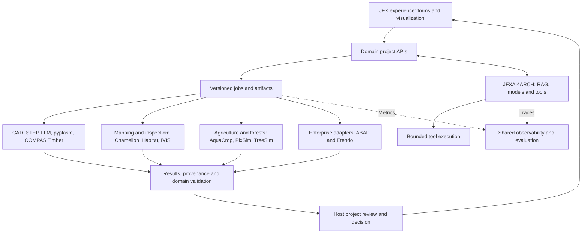
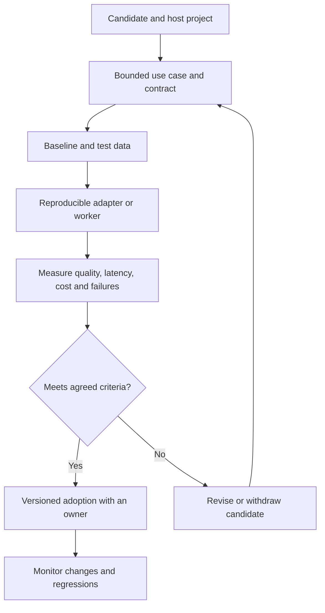

# Component Integration Proposal for the JFX Portfolio

**Review:** October 4, 2026, Lima time.  
**Scope:** restructuring of the file “propuesta categorizada estratégicamente.txt” and an integration proposal.  
**Result:** 69 original references classified: 67 external components, tools or resources and two references to host projects. Not every item is an installable package.

> Translation note: this English version preserves the recommendations and verification findings of the October 4 analysis. Statements about implementation status and repository locations refer to that review, rather than subsequent portfolio changes.

## 1. Main Recommendation

Organize adoption around **shared services and domain-specific adapters**. Each JFX project should retain its models, data and decisions; AI infrastructure can be reused without turning the entire portfolio into a single application or requiring every component to run within GraalVM.

The first selection should favor a small, verifiable workflow. I propose starting with technical RAG and observability in **JFXAI4ARCH**, then demonstrating a domain integration in **JFXAI4DIA**, **JFXLMS4AIR** or **JFXFMIS**, depending on available data and teams.

The destinations and priorities in this document are **architecture recommendations**, inferred from the projects' published scope. They do not represent integrations that have already been implemented. The review checked repository metadata and READMEs for the main destinations and ambiguous components; it did not compile or audit all the code.

## 2. Corrections to the Original List

| Reference | Corrected classification | Implication for the portfolio |
| --- | --- | --- |
| `jfx-meta`, `jfx-embodied-ai`, `jfx-ai-infra`, `jfx-eval-tools`, `jfx-julia`, `jfx-edge-hardware`, `jfx-enterprise-copilots` | Thematic labels in the attachment, not confirmed repositories | Use them as categories; assign ownership to existing projects |
| `jfxai4agri` | Did not appear in the robotics inventory consulted | Use JFXFMIS as the agricultural host; propose a new repository only if justified later |
| `robotics-intelligent-systems/jfxlcdp` | Unconfirmed path; the verified project is [sdk2035/jfxlcdp](https://github.com/sdk2035/jfxlcdp) | Keep the boundary between robotics and the sdk2035 foundations explicit |
| JFXAI4BSS | Its [current README](https://github.com/robotics-intelligent-systems/jfxai4bss) covers buildings, infrastructure and smart communities; the short description retains an older greenhouse reference | Assign timber construction and the built environment to BSS; agronomy to FMIS |
| [TiMBA](https://github.com/sdk2035/TiMBA) | Economic model of forest-product markets | Supply, demand and trade scenarios, separate from robotic manufacturing |
| [PixSim](https://github.com/sdk2035/PixSim) and [TreeSim](https://github.com/sdk2035/TreeSim) | Pixel-based forest growth and individual-tree simulation | Forestry models; their inclusion does not demonstrate synthetic visual dataset generation |
| [hyperwood-bench](https://github.com/sdk2035/hyperwood-bench) | Design of a wooden bench | CAD/CAM demonstrator, not a structural test bench |
| [Juliana.jl](https://github.com/sdk2035/Juliana.jl) | Translation from CUDA.jl to KernelAbstractions.jl | GPU portability in Julia; the Java–Julia bridge is a different component |
| [modular-backpack](https://github.com/sdk2035/modular-backpack) and [Backpack](https://github.com/sdk2035/Backpack) | Voron toolchanger hardware and ExpressLRS firmware, respectively | Two different uses; neither should be presented as a generic sensor backpack |
| [SpeedSeed3](https://github.com/sdk2035/SpeedSeed3) | Accelerated-growth chamber | Experimental environmental automation; do not classify it as a seeder or a demonstrated phenotypic-selection system |
| [chamelion](https://github.com/sdk2035/chamelion) | LiDAR change detection | Direct fit for JFXLMS4AIR, not metaprogramming |
| [Relevance AI](https://github.com/sdk2035/relevanceai) | SDK for accessing an external platform | Optional connector requiring an account and service; it does not replace a self-hosted platform |
| [open-jev](https://github.com/sdk2035/open-jev) and [AnyJev](https://github.com/sdk2035/AnyJev) | Scoring/decision implementations | Candidate evaluation components, not universal benchmark suites |
| [ABAP basic trial](https://github.com/sdk2035/abap-platform-basic-trial) | Workshop material and SAP environment setup | Training reference; a public repository does not make it a redistributable SAP runtime |

## 3. Recommended Host Projects

| Verified project | Proposed responsibility | First useful deliverable |
| --- | --- | --- |
| [JFXAI4ARCH](https://github.com/robotics-intelligent-systems/jfxai4arch) | Shared RAG services, agent tools, inference and traceability | Documentation queries with citations and a reproducible record of each answer |
| [JFXAI4NLP](https://github.com/robotics-intelligent-systems/jfxai4nlp) | Language extraction, code intelligence and evaluation | Labeled dataset and comparison of extractors/evaluators |
| [JFXAI4DIA](https://github.com/robotics-intelligent-systems/jfxai4dia) | CAD artifact generation and validation | Text to candidate STEP, geometry validation and visualization |
| [JFXLMS4AIR](https://github.com/robotics-intelligent-systems/jfxlms4air) | Localization, mapping and perception for inspection | Change detection across two versioned LiDAR captures |
| [JFXFMIS](https://github.com/robotics-intelligent-systems/jfxfmis) | Farm operations, crop models and telemetry | Soil–crop–water scenarios with AquaCrop-OSPy |
| [JFXAI4BSS](https://github.com/robotics-intelligent-systems/jfxai4bss) | Built environment, infrastructure and building twins | Exchange of a timber-frame model and its evidence |
| [JFXOSMS](https://github.com/robotics-intelligent-systems/jfxosms) | Microfactory, manufacturing and quality inspection | Visual inspection result linked to a part/batch |
| [JFXSCADA](https://github.com/robotics-intelligent-systems/jfxscada) | Assets, points, alarms and telemetry histories | Sensor ingestion with units, timestamps and data quality |
| [JFXRTESS](https://github.com/robotics-intelligent-systems/jfxrtess) | Firmware, embedded test benches and integration testing | Reproducible board build and bench results |
| [JFXAI4CV](https://github.com/robotics-intelligent-systems/jfxai4cv) and [JFXAI4RSS](https://github.com/robotics-intelligent-systems/jfxai4rss) | Medical imaging and surgical simulation for research | Reviewed volumetric masks for a simulation scenario |
| [JFXAI4BPM](https://github.com/robotics-intelligent-systems/jfxai4bpm), [JFXAI4CRM](https://github.com/robotics-intelligent-systems/jfxai4crm) and [JFXAI4OHS](https://github.com/robotics-intelligent-systems/jfxai4ohs) | Processes, business relationships and purchasing | Enterprise query adapter with contracts and auditing |
| [sdk2035/jfxlcdp](https://github.com/sdk2035/jfxlcdp) | Complementary foundation for authoring and declarative UI | Forms for running and comparing domain jobs |
| [sdk2035/jfxengine](https://github.com/sdk2035/jfxengine) and [sdk2035/jfxmodelica](https://github.com/sdk2035/jfxmodelica) | Complementary visualization and simulation foundations | Consume artifacts and results through open contracts |
| [sdk2035/jfxlegacy2modern](https://github.com/sdk2035/jfxlegacy2modern) | Complementary foundation for code modernization | A traceable Java or ABAP case, with before/after tests |

**Other potential consumers:** JFXAI4RS for forest maps; JFXAI4CBS for evaluating agent execution policies; JFXLMS for educational material. These assignments are proposed extensions based on public descriptions, not verified capabilities.

## 4. Proposed Integration Architecture

The architecture proposes three connection approaches, depending on the component:

1. **In-process library:** for compatible, bounded JVM components, such as a Java extractor, after checking dependencies and licensing.
2. **Separate worker or service:** the initial option for scientific Python, R, Julia, GPU workloads and ERP systems. Returns job identifiers, artifacts and diagnostics; avoids making the entire UI depend on a native runtime.
3. **Development tool or documentation resource:** C# specifications, IDEs, examples and hardware designs. These integrate into the workflow or catalog, not the production runtime.

**Proposed initial contracts** — design names, not existing APIs:

| Contract | Minimum fields | Use |
| --- | --- | --- |
| Job | `job_id`, project, operation, inputs, versions, status, error | CAD generation, simulation and analysis |
| Artifact | `artifact_id`, URI, hash, format, units, coordinate system, provenance | STEP, point clouds, maps, masks and results |
| Evidence | test case, expectation, result, tolerance, version, reviewer | Technical acceptance independent of the LLM |
| Telemetry | asset, signal, unit, timestamp, quality, schema version | FMIS, SCADA and RTESS test benches |
| Agent tool | name, input/output schema, permissions, timeout, idempotency | MCP or operation adapters |

Models propose or explain; geometry validators, code tests and simulations check the result. Hardware commands remain within the corresponding project's control interfaces.

## 5. Complete Restructured Catalog

**Priorities:** P0 = candidate foundation for the first pilot; P1 = next domain integration; P2 = experiment conditional on a specific need; R = reference, demonstrator or development tool; H = host project. P0 does not mean an already approved dependency.

In each row, the function comes from the repository consulted; the destination and connection approach are this analysis's proposal. Upstream links identify the fork's declared provenance, without claiming that the two are synchronized.

### 5.1. Metaprogramming and Models

| Component and provenance | Function | Proposed destination | Connection and adoption condition | Priority |
| --- | --- | --- | --- | --- |
| [usethesource/rascal](https://github.com/usethesource/rascal) | Language analysis, grammars and transformations | [jfxlcdp](https://github.com/sdk2035/jfxlcdp), [jfxlegacy2modern](https://github.com/sdk2035/jfxlegacy2modern), [jfxai4nlp](https://github.com/robotics-intelligent-systems/jfxai4nlp) | Extract facts and ASTs with code references; define a versioned IR. This alone does not constitute Truffle integration. | P0 |
| [abertschi/graalphp](https://github.com/abertschi/graalphp) | Experimental PHP implementation on GraalVM | [jfxlegacy2modern](https://github.com/sdk2035/jfxlegacy2modern) | Evaluate a PHP subset through differential testing; do not assume compatibility with an entire PHP ERP. | P2 |
| [sdk2035/spoon](https://github.com/sdk2035/spoon) · [upstream](https://github.com/INRIA/spoon) | Java source analysis and transformation | [jfxlcdp](https://github.com/sdk2035/jfxlcdp), [jfxlegacy2modern](https://github.com/sdk2035/jfxlegacy2modern) | Use as a specialized Java extractor; exchange facts with Rascal through a common schema. | P0 |
| [sdk2035/MPS](https://github.com/sdk2035/MPS) · [upstream](https://github.com/JetBrains/MPS) | Environment for building DSLs with dedicated editors | [jfxlcdp](https://github.com/sdk2035/jfxlcdp), [jfxengine](https://github.com/sdk2035/jfxengine) | Prototype a requirements or configuration DSL; export models without requiring end users to install the editor. | P2 |
| [sdk2035/Metalama](https://github.com/sdk2035/Metalama) · [upstream](https://github.com/metalama/Metalama) | C# metaprogramming and architecture patterns on Roslyn | [jfxlegacy2modern](https://github.com/sdk2035/jfxlegacy2modern) | Build-time tool in a separate .NET toolchain; export diagnostics and artifacts. | P2 |
| [sdk2035/csharplang](https://github.com/sdk2035/csharplang) · [upstream](https://github.com/dotnet/csharplang) | C# specifications and design | [jfxlegacy2modern](https://github.com/sdk2035/jfxlegacy2modern), [jfxai4nlp](https://github.com/robotics-intelligent-systems/jfxai4nlp) | Versioned reference corpus for rules and RAG; not a compiler or execution engine. | R |
| [sdk2035/procyon](https://github.com/sdk2035/procyon) · [upstream](https://github.com/mstrobel/procyon) | JVM metaprogramming and decompilation tools | [jfxlegacy2modern](https://github.com/sdk2035/jfxlegacy2modern) | Analyze authorized binaries when source is missing; retain uncertainties and check results. | P2 |
| [sdk2035/openflexo-core](https://github.com/sdk2035/openflexo-core) · [upstream](https://github.com/openflexo-team/openflexo-core) | Model federation infrastructure | [jfxengine](https://github.com/sdk2035/jfxengine), [jfxlcdp](https://github.com/sdk2035/jfxlcdp) | Model adapter with stable IDs; compare against the project's own IR before introducing another core. | P2 |
| [sdk2035/pamela](https://github.com/sdk2035/pamela) · [upstream](https://github.com/openflexo-team/pamela) | Modeling framework in the Openflexo ecosystem | [jfxengine](https://github.com/sdk2035/jfxengine), [jfxlcdp](https://github.com/sdk2035/jfxlcdp) | Evaluate alongside Openflexo for models and persistence; do not present it as a universal verifier. | P2 |
| [sdk2035/diana](https://github.com/sdk2035/diana) · [upstream](https://github.com/openflexo-team/diana) | Diagram-oriented graphics engine | [jfxlcdp](https://github.com/sdk2035/jfxlcdp), [jfxengine](https://github.com/sdk2035/jfxengine) | Editor and export prototype; check integration with the selected UI and avoid duplicating the existing editor. | P2 |
| [sdk2035/connie](https://github.com/sdk2035/connie) · [upstream](https://github.com/openflexo-team/connie) | Expressions and bindings over Java APIs | [jfxlcdp](https://github.com/sdk2035/jfxlcdp) | Evaluate property expressions with permitted functions and error handling; do not assume security isolation. | P2 |

### 5.2. CAD and Timber Manufacturing

| Component and provenance | Function | Proposed destination | Connection and adoption condition | Priority |
| --- | --- | --- | --- | --- |
| [sdk2035/STEP-LLM](https://github.com/sdk2035/STEP-LLM) · [upstream](https://github.com/JasonShiii/STEP-LLM) | Experimental STEP generation from natural language | [jfxai4dia](https://github.com/robotics-intelligent-systems/jfxai4dia), [jfxengine](https://github.com/sdk2035/jfxengine) | Inference worker returning STEP, parameters and evidence; validate geometry before presenting it as an accepted design. | P1 |
| [sdk2035/pyplasm](https://github.com/sdk2035/pyplasm) · [upstream](https://github.com/plasm-language/pyplasm) | Parametric geometric and solid design language | [jfxai4dia](https://github.com/robotics-intelligent-systems/jfxai4dia), [jfxengine](https://github.com/sdk2035/jfxengine) | Python worker for reproducible geometry and verified exports; test compatibility before using GraalPy. | P1 |
| [sdk2035/compas_timber](https://github.com/sdk2035/compas_timber) · [upstream](https://github.com/gramaziokohler/compas_timber) | Timber-frame structure design | [jfxai4bss](https://github.com/robotics-intelligent-systems/jfxai4bss), [jfxai4dia](https://github.com/robotics-intelligent-systems/jfxai4dia), [jfxosms](https://github.com/robotics-intelligent-systems/jfxosms) | Connect geometry, joints and manufacturing data through adapters; do not confuse design with structural certification. | P1 |
| [sdk2035/hyperwood-bench](https://github.com/sdk2035/hyperwood-bench) · [upstream](https://github.com/jo/hyperwood-bench) | Parametric wooden-bench design | [jfxai4dia](https://github.com/robotics-intelligent-systems/jfxai4dia), [jfxosms](https://github.com/robotics-intelligent-systems/jfxosms) | Design-to-manufacturing and bill-of-materials demonstrator; not a biomechanical benchmark. | R |

### 5.3. Perception and Inspection Robotics

| Component and provenance | Function | Proposed destination | Connection and adoption condition | Priority |
| --- | --- | --- | --- | --- |
| [sdk2035/chamelion](https://github.com/sdk2035/chamelion) · [upstream](https://github.com/url-kaist/chamelion) | Change detection between LiDAR scans and prior maps | [jfxlms4air](https://github.com/robotics-intelligent-systems/jfxlms4air) | Batch service for added/removed changes with confidence; evaluate errors in inspection maps. | P1 |
| [sdk2035/habitat-sim](https://github.com/sdk2035/habitat-sim) · [upstream](https://github.com/facebookresearch/habitat-sim) | 3D simulator for embodied-agent research | [jfxlms4air](https://github.com/robotics-intelligent-systems/jfxlms4air), [jfxengine](https://github.com/sdk2035/jfxengine) | Generate reproducible navigation and perception episodes; deliver observations and metrics to the console. | P1 |
| [sdk2035/habitat-lab](https://github.com/sdk2035/habitat-lab) · [upstream](https://github.com/facebookresearch/habitat-lab) | Tasks, training and evaluation for embodied agents | [jfxlms4air](https://github.com/robotics-intelligent-systems/jfxlms4air) | Experimentation layer over the simulator, with pinned scene, agent and task versions. | P1 |
| [sdk2035/physical-ai-studio](https://github.com/sdk2035/physical-ai-studio) · [upstream](https://github.com/open-edge-platform/physical-ai-studio) | Robot training through imitation of demonstrations | [jfxosms](https://github.com/robotics-intelligent-systems/jfxosms), [jfxrtess](https://github.com/robotics-intelligent-systems/jfxrtess) | Manipulation pilot in simulation and on a controlled test bench; retain versioned datasets and policies. | P2 |
| [nvidia-isaac/video_to_data](https://github.com/nvidia-isaac/video_to_data) | Video, reconstruction and robotics training-data pipeline | [jfxosms](https://github.com/robotics-intelligent-systems/jfxosms), [jfxengine](https://github.com/sdk2035/jfxengine) | Offline processing of demonstrations into scenes/datasets; validate embodiment and simulator compatibility rather than converting video directly into plant commands. | P2 |
| [sdk2035/Integrated-Vision-Inspection-System-IVIS](https://github.com/sdk2035/Integrated-Vision-Inspection-System-IVIS) · [upstream](https://github.com/msf4-0/Integrated-Vision-Inspection-System-IVIS) | Industrial visual inspection system | [jfxosms](https://github.com/robotics-intelligent-systems/jfxosms), [jfxscada](https://github.com/robotics-intelligent-systems/jfxscada) | Adapter sending inspection results to quality events and batch traceability. | P1 |
| [sdk2035/vision_transformer](https://github.com/sdk2035/vision_transformer) · [upstream](https://github.com/google-research/vision_transformer) | Vision Transformer and MLP-Mixer implementations | [jfxai4cv](https://github.com/robotics-intelligent-systems/jfxai4cv), [jfxosms](https://github.com/robotics-intelligent-systems/jfxosms) | Vision baseline to compare on the project's own data; do not present it as a validated medical model. | P2 |

### 5.4. Medical Imaging and Simulation

| Component and provenance | Function | Proposed destination | Connection and adoption condition | Priority |
| --- | --- | --- | --- | --- |
| [sdk2035/SAM-Med3D](https://github.com/sdk2035/SAM-Med3D) · [upstream](https://github.com/uni-medical/SAM-Med3D) | Volumetric medical-image segmentation | [jfxai4cv](https://github.com/robotics-intelligent-systems/jfxai4cv), [jfxai4rss](https://github.com/robotics-intelligent-systems/jfxai4rss) | Segmentation worker for research and simulation; return masks with geometry, version and expert review. | P2 |

### 5.5. Agriculture, Forests and Forest Economics

| Component and provenance | Function | Proposed destination | Connection and adoption condition | Priority |
| --- | --- | --- | --- | --- |
| [sdk2035/aquacrop](https://github.com/sdk2035/aquacrop) · [upstream](https://github.com/aquacropos/aquacrop) | AquaCrop-OSPy: soil–crop–water model | [jfxfmis](https://github.com/robotics-intelligent-systems/jfxfmis) | Irrigation scenario service using weather, soil and crop inputs; record units, parameters and calibration results. | P1 |
| [sdk2035/Drip-3Dponics](https://github.com/sdk2035/Drip-3Dponics) · [upstream](https://github.com/3dponics/Drip-3Dponics) | Printable hydroponics designs | [jfxfmis](https://github.com/robotics-intelligent-systems/jfxfmis), [jfxai4dia](https://github.com/robotics-intelligent-systems/jfxai4dia) | CAD and materials catalog for the system; instrumentation and control require additional components. | P2 |
| [sdk2035/SpeedSeed3](https://github.com/sdk2035/SpeedSeed3) · [upstream](https://github.com/GrowCab/SpeedSeed3) | Accelerated-growth system in a benchtop chamber | [jfxfmis](https://github.com/robotics-intelligent-systems/jfxfmis), [jfxscada](https://github.com/robotics-intelligent-systems/jfxscada) | Integrate environmental records and experimental recipes; review old dependencies before reusing the software. | P2 |
| [sdk2035/TiMBA](https://github.com/sdk2035/TiMBA) · [upstream](https://github.com/TI-Forest-Sector-Modelling/TiMBA) | Economic model of forest-product markets | [jfxfmis](https://github.com/robotics-intelligent-systems/jfxfmis), [jfxai4bpm](https://github.com/robotics-intelligent-systems/jfxai4bpm) | Optional module for supply, demand and trade scenarios; keep aggregate results separate from crop control. | P2 |
| [sdk2035/PixSim](https://github.com/sdk2035/PixSim) · [upstream](https://github.com/nicoscattaneo/PixSim) | Pixel-based forest-growth simulation in R | [jfxfmis](https://github.com/robotics-intelligent-systems/jfxfmis), [jfxai4rs](https://github.com/robotics-intelligent-systems/jfxai4rs) | R worker with growth maps and scenarios; do not classify it as a synthetic-foliage generator for vision. | P2 |
| [sdk2035/TreeSim](https://github.com/sdk2035/TreeSim) · [upstream](https://github.com/AbbasNabhani/TreeSim) | Individual-tree simulation and 3D visualization | [jfxfmis](https://github.com/robotics-intelligent-systems/jfxfmis), [jfxengine](https://github.com/sdk2035/jfxengine) | Forestry model with regional parameters; export forest state and geometry through a dedicated contract. | P2 |
| [sdk2035/isoblue](https://github.com/sdk2035/isoblue) · [upstream](https://github.com/oats-center/isoblue) | ISOBlue/Avena agricultural data hardware and software | [jfxfmis](https://github.com/robotics-intelligent-systems/jfxfmis), [jfxscada](https://github.com/robotics-intelligent-systems/jfxscada) | Machinery telemetry gateway; validate messages, timing and compatibility with real equipment. | P1 |

### 5.6. Shared AI Services

| Component and provenance | Function | Proposed destination | Connection and adoption condition | Priority |
| --- | --- | --- | --- | --- |
| [sdk2035/OpenShell](https://github.com/sdk2035/OpenShell) · [upstream](https://github.com/NVIDIA/OpenShell) | Isolated execution environment for agents | [jfxai4arch](https://github.com/robotics-intelligent-systems/jfxai4arch), [jfxai4cbs](https://github.com/robotics-intelligent-systems/jfxai4cbs) | Evaluate as a job runtime with bounded policies and credentials; verify its guarantees in the selected deployment. | P1 |
| [sdk2035/mcp-memory-service](https://github.com/sdk2035/mcp-memory-service) · [upstream](https://github.com/doobidoo/mcp-memory-service) | Persistent agent memory with APIs and MCP | [jfxai4arch](https://github.com/robotics-intelligent-systems/jfxai4arch), [jfxai4nlp](https://github.com/robotics-intelligent-systems/jfxai4nlp) | Optional memory service separate from the evidence repository; partition by user, project and retention policy. | P1 |
| [sdk2035/ray](https://github.com/sdk2035/ray) · [upstream](https://github.com/ray-project/ray) | Distributed computing and AI libraries | [jfxai4arch](https://github.com/robotics-intelligent-systems/jfxai4arch), [jfxengine](https://github.com/sdk2035/jfxengine) | Job executor when measured workload justifies distribution; begin with simple workers. | P2 |
| [sdk2035/kserve](https://github.com/sdk2035/kserve) · [upstream](https://github.com/kserve/kserve) | Inference serving on Kubernetes | [jfxai4arch](https://github.com/robotics-intelligent-systems/jfxai4arch) | Deployment profile for teams already operating Kubernetes; not a prerequisite for the first pilot. | P2 |
| [sdk2035/langflow](https://github.com/sdk2035/langflow) · [upstream](https://github.com/langflow-ai/langflow) | AI flow and agent builder | [jfxai4arch](https://github.com/robotics-intelligent-systems/jfxai4arch), [jfxai4nlp](https://github.com/robotics-intelligent-systems/jfxai4nlp) | Optional authoring tool; export/version flows and keep execution contracts independent. | P1 |
| [sdk2035/AutoGPT](https://github.com/sdk2035/AutoGPT) · [upstream](https://github.com/Significant-Gravitas/AutoGPT) | Agent platform and tools | [jfxai4arch](https://github.com/robotics-intelligent-systems/jfxai4arch) | Experimental orchestration alternative; evaluate components and licenses before selecting it alongside another orchestrator. | P2 |
| [sdk2035/relevanceai](https://github.com/sdk2035/relevanceai) · [upstream](https://github.com/RelevanceAI/relevanceai) | SDK for the Relevance AI platform | [jfxai4crm](https://github.com/robotics-intelligent-systems/jfxai4crm), [jfxai4arch](https://github.com/robotics-intelligent-systems/jfxai4arch) | Optional external connector; requires an account and service terms, and is not equivalent to a fully self-hosted platform. | P2 |
| [langfuse/langfuse](https://github.com/langfuse/langfuse) | Observability and evaluation for LLM applications | [jfxai4arch](https://github.com/robotics-intelligent-systems/jfxai4arch), [jfxai4nlp](https://github.com/robotics-intelligent-systems/jfxai4nlp) | Common contract for traces, versions, evaluations and metrics; check for duplication with existing observability. | P0 |
| [sdk2035/semantic-caching-with-redis-langcache](https://github.com/sdk2035/semantic-caching-with-redis-langcache) · [upstream](https://github.com/redis-developer/semantic-caching-with-redis-langcache) | Semantic caching demonstration using Redis LangCache | [jfxai4arch](https://github.com/robotics-intelligent-systems/jfxai4arch) | Reference for an experiment with invalidation, tenant separation and stale-answer measurement. | R |
| [sdk2035/mlx](https://github.com/sdk2035/mlx) · [upstream](https://github.com/ml-explore/mlx) | Array and ML framework targeting Apple silicon | [jfxai4arch](https://github.com/robotics-intelligent-systems/jfxai4arch), [jfxai4nlp](https://github.com/robotics-intelligent-systems/jfxai4nlp) | Optional backend for compatible workstations; separate this profile from Linux/CUDA deployment and measure specific models. | P2 |
| [sdk2035/llama_index](https://github.com/sdk2035/llama_index) · [upstream](https://github.com/run-llama/llama_index) | Document processing and retrieval for AI | [jfxai4arch](https://github.com/robotics-intelligent-systems/jfxai4arch), [jfxai4nlp](https://github.com/robotics-intelligent-systems/jfxai4nlp) | Initial ingestion/RAG pipeline with citations, document versions and retrieval tests. | P0 |
| [sdk2035/cohere-toolkit](https://github.com/sdk2035/cohere-toolkit) · [upstream](https://github.com/cohere-ai/cohere-toolkit) | Components and examples for RAG applications | [jfxai4arch](https://github.com/robotics-intelligent-systems/jfxai4arch), [jfxai4crm](https://github.com/robotics-intelligent-systems/jfxai4crm) | Reference or alternative accelerator; isolate provider dependencies through the model gateway. | P2 |
| [Sumanth077/Hands-On-AI-Engineering](https://github.com/Sumanth077/Hands-On-AI-Engineering) | Educational collection of OCR, RAG and agent projects | [jfxai4nlp](https://github.com/robotics-intelligent-systems/jfxai4nlp), [jfxlms](https://github.com/robotics-intelligent-systems/jfxlms) | Patterns and learning material; review the grounded_document_agent example before reusing code. | R |
| [sdk2035/seekdb](https://github.com/sdk2035/seekdb) · [upstream](https://github.com/oceanbase/seekdb) | Search engine with vector and structured data | [jfxai4arch](https://github.com/robotics-intelligent-systems/jfxai4arch), [jfxai4nlp](https://github.com/robotics-intelligent-systems/jfxai4nlp) | Compare as a retrieval store; do not replace the transactional database without testing requirements. | P2 |

### 5.7. Model Evaluation and Decisions

| Component and provenance | Function | Proposed destination | Connection and adoption condition | Priority |
| --- | --- | --- | --- | --- |
| [sdk2035/jevals](https://github.com/sdk2035/jevals) · [upstream](https://github.com/openlayer-ai/jevals) | Trace evaluation using decision models | [jfxai4nlp](https://github.com/robotics-intelligent-systems/jfxai4nlp), [jfxai4arch](https://github.com/robotics-intelligent-systems/jfxai4arch) | Compare groundedness, tool selection and scope against human-labeled examples. | P1 |
| [sdk2035/open-jev](https://github.com/sdk2035/open-jev) · [upstream](https://github.com/daseinlabs/open-jev) | Local option scoring with Gemma and MLX | [jfxai4nlp](https://github.com/robotics-intelligent-systems/jfxai4nlp) | Experimental evaluation backend; check platform, data distribution and calibration. | P2 |
| [sdk2035/AnyJev](https://github.com/sdk2035/AnyJev) · [upstream](https://github.com/nokia-applied-research/AnyJev) | Typed decisions based on model probabilities | [jfxai4nlp](https://github.com/robotics-intelligent-systems/jfxai4nlp), [jfxai4arch](https://github.com/robotics-intelligent-systems/jfxai4arch) | Compare with classifiers and rules; do not interpret probabilities as demonstrated reliability without local calibration. | P2 |

### 5.8. Development Tools

| Component and provenance | Function | Proposed destination | Connection and adoption condition | Priority |
| --- | --- | --- | --- | --- |
| [sdk2035/kirodex](https://github.com/sdk2035/kirodex) · [upstream](https://github.com/thabti/kirodex) | Desktop application for coding agents | [jfxlcdp](https://github.com/sdk2035/jfxlcdp) | Optional developer tool; do not integrate it as a product runtime dependency. | R |
| [sdk2035/spec-for-codex](https://github.com/sdk2035/spec-for-codex) · [upstream](https://github.com/atman-33/spec-for-codex) | Extension for specification-driven development | [jfxlcdp](https://github.com/sdk2035/jfxlcdp) | Evaluate specification format and export in the contribution workflow. | R |
| [sdk2035/spec-for-codex-ide](https://github.com/sdk2035/spec-for-codex-ide) · [upstream](https://github.com/atman-33/spec-for-codex-ide) | IDE extension for specifications and assistants | [jfxlcdp](https://github.com/sdk2035/jfxlcdp) | Compare with spec-for-codex and choose one experience, avoiding functional duplication. | R |
| [sdk2035/tasktrooper](https://github.com/sdk2035/tasktrooper) · [upstream](https://github.com/makifbaysal/tasktrooper) | Task management and development-agent execution | [jfxai4arch](https://github.com/robotics-intelligent-systems/jfxai4arch) | Team tool for tasks/artifacts; using it does not turn the product into an autonomous-agent system. | R |
| [sdk2035/bruno](https://github.com/sdk2035/bruno) · [upstream](https://github.com/usebruno/bruno) | API client and testing tool | [jfxai4arch](https://github.com/robotics-intelligent-systems/jfxai4arch), [jfxai4bpm](https://github.com/robotics-intelligent-systems/jfxai4bpm), [jfxscada](https://github.com/robotics-intelligent-systems/jfxscada) | Versioned collections for contracts, authentication, errors, retries and idempotency in adapters. | P0 |

### 5.9. Scientific Computing and Interoperability

| Component and provenance | Function | Proposed destination | Connection and adoption condition | Priority |
| --- | --- | --- | --- | --- |
| [sdk2035/julia4j](https://github.com/sdk2035/julia4j) · [upstream](https://github.com/rssdev10/julia4j) | Java–Julia binding through JNI and libjulia | [jfxengine](https://github.com/sdk2035/jfxengine), [jfxmodelica](https://github.com/sdk2035/jfxmodelica) | Bounded prototype for types, memory and lifecycle; the README describes basic functions and outstanding work. | P2 |
| [sdk2035/Juliana.jl](https://github.com/sdk2035/Juliana.jl) · [upstream](https://github.com/artecs-group/Juliana.jl) | Translation from CUDA.jl to KernelAbstractions.jl | [jfxengine](https://github.com/sdk2035/jfxengine), [jfxai4dia](https://github.com/robotics-intelligent-systems/jfxai4dia) | GPU portability experiment on selected Julia kernels; not a Java/GraalVM bridge. | P2 |
| [genieframework/Genie.jl](https://github.com/genieframework/Genie.jl) | Julia web framework | [jfxengine](https://github.com/sdk2035/jfxengine), [jfxmodelica](https://github.com/sdk2035/jfxmodelica) | Option for exposing scientific jobs as a service; maintain a stable API toward JavaFX. | P2 |

### 5.10. Firmware and Laboratory Hardware

| Component and provenance | Function | Proposed destination | Connection and adoption condition | Priority |
| --- | --- | --- | --- | --- |
| [sdk2035/platformio-core](https://github.com/sdk2035/platformio-core) · [upstream](https://github.com/platformio/platformio-core) | Embedded build and development tools | [jfxrtess](https://github.com/robotics-intelligent-systems/jfxrtess), [jfxscada](https://github.com/robotics-intelligent-systems/jfxscada) | Reproducible build toolchain per board; retain firmware, configuration and test results. | P1 |
| [sdk2035/Tasmota](https://github.com/sdk2035/Tasmota) · [upstream](https://github.com/arendst/Tasmota) | IoT firmware for compatible ESP devices | [jfxscada](https://github.com/robotics-intelligent-systems/jfxscada), [jfxfmis](https://github.com/robotics-intelligent-systems/jfxfmis) | Sensor and MQTT/HTTP telemetry pilot; do not use as a substitute for industrial safety logic. | P1 |
| [sdk2035/modular-backpack](https://github.com/sdk2035/modular-backpack) · [upstream](https://github.com/onsimon/modular-backpack) | Parts and cable distribution for Voron toolchangers | [jfxosms](https://github.com/robotics-intelligent-systems/jfxosms), [jfxai4dia](https://github.com/robotics-intelligent-systems/jfxai4dia) | Mechanical/electrical reference for laboratory printers; not a portable robotic backpack. | R |
| [sdk2035/Backpack](https://github.com/sdk2035/Backpack) · [upstream](https://github.com/ExpressLRS/Backpack) | ExpressLRS firmware for compatible FPV hardware | [jfxrtess](https://github.com/robotics-intelligent-systems/jfxrtess) | Evaluation bench for configuration and telemetry; not equivalent to modular-backpack. | P2 |
| [sdk2035/OpenLaptop](https://github.com/sdk2035/OpenLaptop) · [upstream](https://github.com/MiklosPathy/OpenLaptop) | Laptop hardware design | [jfxrtess](https://github.com/robotics-intelligent-systems/jfxrtess), [jfxengine](https://github.com/sdk2035/jfxengine) | Laboratory workstation reference; verify component availability and manufacturing cost. | R |
| [sdk2035/Openterface_KVM-GO_Hardware](https://github.com/sdk2035/Openterface_KVM-GO_Hardware) · [upstream](https://github.com/TechxArtisanStudio/Openterface_KVM-GO_Hardware) | KVM hardware design files | [jfxrtess](https://github.com/robotics-intelligent-systems/jfxrtess), [jfxscada](https://github.com/robotics-intelligent-systems/jfxscada) | Maintenance access to bench equipment; review capture, control and permissions without treating it as a robot controller. | R |

### 5.11. Enterprise Modernization and ABAP

| Component and provenance | Function | Proposed destination | Connection and adoption condition | Priority |
| --- | --- | --- | --- | --- |
| [sdk2035/abap-platform-basic-trial](https://github.com/sdk2035/abap-platform-basic-trial) · [upstream](https://github.com/SAP-samples/abap-platform-basic-trial) | Workbook and setup for a SAP ABAP Cloud environment | [jfxlegacy2modern](https://github.com/sdk2035/jfxlegacy2modern) | Laboratory reference and examples; requires a SAP environment and is not an open distribution of the SAP runtime. | R |
| [open-abap/open-abap-core](https://github.com/open-abap/open-abap-core) | Reusable ABAP artifacts for abaplint/transpiler | [jfxlegacy2modern](https://github.com/sdk2035/jfxlegacy2modern) | Test an ABAP subset; it does not represent a complete SAP kernel or a Truffle implementation. | P1 |
| [sdk2035/abap-mcp](https://github.com/sdk2035/abap-mcp) · [upstream](https://github.com/abap-ai/mcp) | MCP server SDK implemented in ABAP | [jfxai4bpm](https://github.com/robotics-intelligent-systems/jfxai4bpm), [jfxlegacy2modern](https://github.com/sdk2035/jfxlegacy2modern) | ABAP query and tool adapter; the README marks this generation as frozen and points to mcp2 for further development. | P1 |
| [sdk2035/ai-abap-assistant-sample](https://github.com/sdk2035/ai-abap-assistant-sample) · [upstream](https://github.com/google/ai-abap-assistant-sample) | Example of code assistance and review in the ABAP editor | [jfxlegacy2modern](https://github.com/sdk2035/jfxlegacy2modern), [jfxai4nlp](https://github.com/robotics-intelligent-systems/jfxai4nlp) | Reference for explanations, reviews and test proposals with human review. | R |
| [sdk2035/SAP_Project](https://github.com/sdk2035/SAP_Project) · [upstream](https://github.com/PrithviVenu/SAP_Project) | Demonstration application for ABAP analysis for S/4HANA | [jfxlegacy2modern](https://github.com/sdk2035/jfxlegacy2modern) | Study UX and the analysis workflow; require semantic tests before accepting suggested refactorings. | R |
| [sdk2035/com.etendoerp.copilot](https://github.com/sdk2035/com.etendoerp.copilot) · [upstream](https://github.com/etendosoftware/com.etendoerp.copilot) | Copilot and tools in the Etendo ecosystem | [jfxai4bpm](https://github.com/robotics-intelligent-systems/jfxai4bpm), [jfxai4crm](https://github.com/robotics-intelligent-systems/jfxai4crm), [jfxai4ohs](https://github.com/robotics-intelligent-systems/jfxai4ohs) | Connector to an Etendo instance or design reference; do not assume direct installation into Axelor, Dolibarr or OFBiz. | P2 |

### 5.12. Host Projects, Not Packages

| Component and provenance | Function | Proposed destination | Connection and adoption condition | Priority |
| --- | --- | --- | --- | --- |
| [robotics-intelligent-systems/jfxai4bpm](https://github.com/robotics-intelligent-systems/jfxai4bpm) | Portfolio process-orchestration project | [jfxai4bpm](https://github.com/robotics-intelligent-systems/jfxai4bpm) | Host for enterprise contracts and adapters; do not count it as an external dependency. | H |
| `robotics-intelligent-systems/jfxlcdp` → [sdk2035/jfxlcdp](https://github.com/sdk2035/jfxlcdp) | Reference in the attachment that should be corrected to sdk2035/jfxlcdp | [jfxlcdp](https://github.com/sdk2035/jfxlcdp) | Use the verified sdk2035/jfxlcdp path as the interface/low-code project; no same-named repository under robotics was confirmed. | H |

## 6. Restructuring the Cross-Cutting Stack

The attachment's final list mixes languages, runtimes, libraries, managed services and practices. Each should be recorded with its type and responsibility.

| Layer | Initial proposal | Alternatives and limits |
| --- | --- | --- |
| UI | JavaFX for desktop; React/TypeScript for web when there is a use case | React is a UI library, not a language. `reactj4j` remains an unidentified reference: the attachment provides no repository or version |
| Core and contracts | JVM for Java components; APIs for external workers | GraalVM is an execution/optimization option that must be measured; it does not automatically turn the entire stack into a single application |
| Scientific Python and ML | CPython workers for the first prototype; evaluate GraalPy per package and platform | GraalPy implements Python 3; Jython maintains the Python 2.7 line and is not an equivalent substitute for this ecosystem. See [GraalPy](https://www.graalvm.org/reference-manual/graalpy/) and [Jython](https://www.jython.org/news.html) |
| JavaScript and TypeScript | TypeScript compiled to JavaScript; a Node service when Node APIs are required | Embedded GraalJS does not automatically provide `fs`, `http` or other Node APIs. See the [interoperability documentation](https://www.graalvm.org/reference-manual/js/NashornMigrationGuide/) |
| Go | Native service with an HTTP/gRPC contract if it adds value | `golang-jvm` remains unidentified and is not recommended: a concrete reference and compatibility tests are missing |
| Julia and R | Separate scientific workers or services | Evaluate JNI/libjulia only if measurements justify its complexity; Juliana.jl addresses GPU portability, not JVM integration |
| LLM orchestration | Choose a primary runtime; LlamaIndex for the proposed ingestion, LangChain or LangChain4j when their ecosystem fits the service | Langflow may provide authoring; AutoGPT and Relevance AI are alternatives with their own limits. Avoid deploying all of them without distinct responsibilities |
| Model providers | Interchangeable gateway for local models, OpenAI API or AWS Bedrock | Record provider, version, transmitted data and per-task cost; select through evaluation without assuming functional equivalence |
| Persistence | PostgreSQL for transactional records; object storage for artifacts | DynamoDB is a managed alternative for a specific access pattern, not another mandatory dependency |
| Retrieval | Select a text/vector index using a test query set | SeekDB is a comparison candidate; avoid introducing multiple databases merely because they appear in the list |
| Cache | Redis only where a measured benefit exists | Semantic caching requires invalidation, user/project scope and stale-answer tests; it does not replace the evidence source |
| Packaging | Docker containers per worker; reproducible configuration | GPU, devices and native runtimes need explicit profiles |
| Optional AWS | ECS for services/containers, S3 for artifacts, RDS for the PostgreSQL option and CloudWatch for operations | Lambda and API Gateway for tasks/adapters suited to their limits; do not assume every simulation or GPU workload fits Lambda |
| Infrastructure as code | Choose Terraform or CloudFormation according to the operating environment | Do not maintain two divergent descriptions of the same infrastructure |
| Scaling | Simple workers initially; Ray when distributed computing is needed, KServe when Kubernetes is already operated for inference | These are different responsibilities; they can coexist when a measured need justifies it |
| APIs | REST for jobs/artifacts; events or WebSocket for progress and telemetry | GraphQL is optional for aggregate queries; gRPC may serve internal contracts. MCP exposes tools, not a replacement for every protocol |
| Testing | Unit, API contract, integration and domain-specific scientific tests | Bruno helps test APIs; jevals/AnyJev/open-jev do not replace geometry, semantics or hardware tests |
| Continuous delivery | CI/CD with pinned versions, artifacts and test results | Record code, models, datasets, configurations and firmware separately |

Compatibility with native extensions and platforms must be evaluated for the selected versions; the [GraalPy documentation](https://www.graalvm.org/latest/python/docs/) distinguishes support by platform and package. The proposal does not presume speed improvements from switching runtimes.

## 7. Proposed Pilots and Acceptance Criteria

The quantities below are planning starting points, not quality estimates or performance commitments. Run the shared pilot first, then select a domain.

| Pilot | Project and selection | Deliverable | Criterion for deciding whether to continue |
| --- | --- | --- | --- |
| A. Technical assistant with evidence | JFXAI4ARCH + JFXAI4NLP; LlamaIndex, Langfuse and Bruno | Ingestion of authorized documents, queries with citations and a trace for each execution | Compare answers over approximately 50 reviewed questions; measure retrieval, citation support, abstention, latency and cost; set thresholds before evaluation |
| B. Verifiable text-to-CAD | JFXAI4DIA + JFXENGINE; STEP-LLM and a geometry validator | Candidate STEP generator with a report and viewer | Test approximately 20 simple parts; measure validity, units, dimensions, geometry and failures. A renderable image is not sufficient for manufacturing acceptance |
| C. Change inspection | JFXLMS4AIR; Chamelion, project-owned scenes/datasets and Habitat when it contributes a useful task | Detection of added and removed elements between captures | Measure precision, recall, registration error and time; compare against a baseline over annotated changes |
| D. Agricultural scenarios | JFXFMIS; AquaCrop-OSPy, ISOBlue or existing records | Water/crop scenario and telemetry comparison tool | Validate inputs/units, reproducibility and local calibration; present decisions as scenarios without automating irrigation from the LLM |
| E. ABAP modernization | JFXLEGACY2MODERN + JFXAI4BPM; open-abap-core and a SAP/MCP adapter | Analysis and transformation of a small subset with tests | Define support, compare behavior and errors, and record unsupported constructs; begin with queries before enterprise writes |

**Suggested execution order:**

1. Inventory versions, data availability and ownership; select one provider/model and one storage path per pilot.
2. Build contracts and a deterministic baseline; add AI only where its contribution can be compared.
3. Run tests, record failures and review the adoption decision.
4. Introduce distribution, persistent memory or semantic caching only after measuring the bottleneck.

## 8. Decisions That Should Remain Separate

- **Rascal, Spoon and MPS:** Rascal for rules and languages, Spoon as a specialized Java extractor, MPS when DSL authoring is needed. They are not three interchangeable engines for the same task.
- **Langflow, AutoGPT and Relevance AI:** evaluate authoring/orchestration/connector alternatives; do not declare all of them mandatory dependencies.
- **Ray and KServe:** distinguish distributed computing from inference serving on Kubernetes.
- **Habitat and Video to Data:** navigation/embodied tasks versus reconstruction and learning from demonstrations. Choose according to task, environment and robot.
- **AquaCrop, PixSim, TreeSim and TiMBA:** crop/water, spatial forest growth, individual trees and forest economics, respectively. Combining them requires compatible models and scales.
- **COMPAS Timber and hyperwood-bench:** design tool versus product example; both fit CAD/manufacturing better than agronomic simulation.
- **Agent memory and evidence:** memory may summarize experiences; technical statements must be traceable to identifiable documents, data and results.
- **Etendo and other ERPs in the catalog:** reusing an API or pattern does not mean the module installs unchanged in other ERPs.

## 9. Minimum Record for Component Adoption

For each selected candidate, retain:

| Field | Purpose |
| --- | --- |
| Requested repository, upstream and commit/tag | Know exactly which code is used and whether the fork is behind |
| Artifact type | Distinguish library, service, tool, dataset, model, documentation and hardware |
| Code, model, data and design licenses | Resolve the conditions applicable to each artifact; do not infer them solely from public visibility |
| Host project and owner | Assign maintenance and acceptance responsibility |
| Integration contract | Version inputs, outputs, units, errors and limits |
| Tested environment | Runtime, OS, CPU/GPU, native dependencies and resources |
| Test evidence | Baseline, dataset, metrics, known failures and decision |
| Operating and exit costs | Measure resources and define how to replace or retire the component |

GitHub metadata shows diverse licenses and some cases without conclusive identification. This document does not determine legal compatibility or presume that all repositories can be reused under the same conditions.

## 10. Verification Scope

The inventory covered **47 JFX repositories** visible under `robotics-intelligent-systems` and eight JFX references under `sdk2035`. The attachment's 69 references were checked against GitHub; the JFXLCDP path under robotics was not confirmed and was corrected to the verified sdk2035 project.

To classify destinations, the review read the READMEs of JFXAI4ARCH, JFXAI4NLP, JFXAI4DIA, JFXLMS4AIR, JFXAI4CV, JFXAI4BSS, JFXFMIS, JFXOSMS, JFXSCADA, JFXAI4RSS, JFXAI4BIO, JFXAI4BPM, JFXAI4CRM, JFXAI4OHS and JFXRTESS. It also reviewed READMEs for components whose names or original descriptions could be misleading, such as TiMBA, PixSim, TreeSim, Juliana.jl, hyperwood-bench, the two Backpack projects, ABAP MCP, Relevance AI and Julia4J.

Each row links to the component source and, where a fork exists, its declared upstream. The recommendations for destinations, priorities, contracts and pilots are the proposed work in this document. No packages were installed, no models or simulations were run, and no GitHub repositories were modified during the original analysis.
